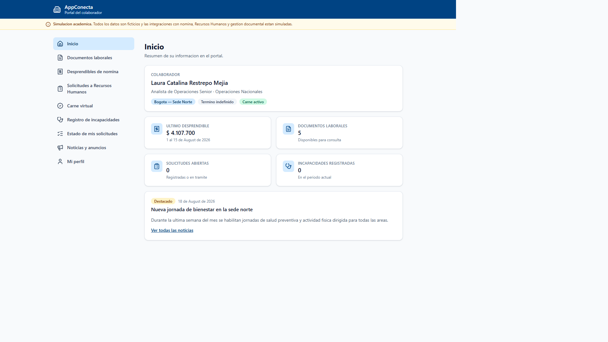
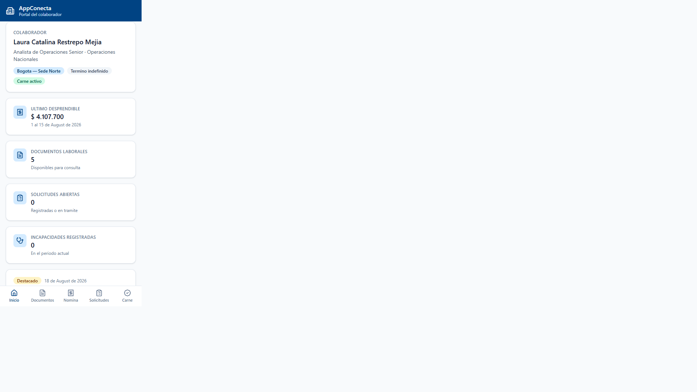

# AppConecta

**Portal del colaborador**, implementado como Progressive Web App. Repositorio del proyecto
integrador de la asignatura **Gestión de Configuración y Mantenimiento de Software** (Maestría en
Ingeniería de Software, Universidad de La Sabana).

**Aplicación desplegada:** <https://llipiterdev.github.io/appconecta-scm/>
**Versión actual:** v0.2.0 · [CHANGELOG](CHANGELOG.md) · [Releases](https://github.com/llipiterdev/appconecta-scm/releases)

## Qué es AppConecta

AppConecta centraliza, para un colaborador ficticio, los trámites y consultas habituales frente a
Recursos Humanos:

| Sección                   | Qué permite                                                                   |
| ------------------------- | ----------------------------------------------------------------------------- |
| **Dashboard**             | Resumen del colaborador, último desprendible y documentos recientes           |
| **Perfil**                | Datos del colaborador: cargo, área, sede, tipo de contrato, jefe inmediato    |
| **Noticias**              | Anuncios y comunicados corporativos                                           |
| **Documentos**            | Consulta y descarga simulada de documentos laborales, filtrable por categoría |
| **Nómina**                | Consulta de desprendibles de pago liquidados                                  |
| **Solicitudes**           | Creación de solicitudes de Recursos Humanos                                   |
| **Incapacidades**         | Registro de incapacidades médicas                                             |
| **Estado de solicitudes** | Seguimiento de los trámites en curso                                          |
| **Carné virtual**         | Acreditación del colaborador con código QR y estado activo/inactivo           |

La interfaz es responsive y mobile-first: navegación por barra lateral en escritorio y por barra
inferior en móvil, con estados de carga, vacíos y de error en cada sección.

<p>
  
  
</p>

Más capturas, incluido el carné virtual con su código QR, en
[`docs/evidencias/capturas/`](docs/evidencias/capturas/).

## Aviso de alcance: esta es una simulación académica

**AppConecta, tal como existe en este repositorio, es una simulación funcional con
propósito académico.** No es una aplicación legacy real, no ha estado diez años en
producción y no contiene datos reales de ninguna organización.

Los diagnósticos de las Actividades 1 y 2 describen AppConecta como una aplicación móvil
corporativa con aproximadamente diez años de operación sin mantenimiento significativo.
Ese escenario es un **supuesto académico heredado** de dichos documentos, autorizado por el
docente del curso, y no una afirmación sobre hechos reales:

- No existen diez años reales de commits en este repositorio.
- No se han retrocedido ni falsificado fechas de Git.
- No se han fabricado incidentes, vulnerabilidades históricas ni métricas.
- Todas las integraciones con sistemas corporativos (nómina, RRHH, autenticación,
  base de datos) son **simuladas mediante mocks y datos ficticios**.
- Los datos de colaborador, documentos, nómina y anuncios son **completamente ficticios**.

La aplicación de este repositorio es una **Progressive Web App** que representa
académicamente el cliente móvil de AppConecta, para poder evidenciar de forma verificable
una estrategia de control de versiones, gestión de configuración y automatización DevOps.

## Stack

| Capa               | Tecnología                                                          |
| ------------------ | ------------------------------------------------------------------- |
| Framework de UI    | React 19 con TypeScript                                             |
| Build              | Vite                                                                |
| Enrutamiento       | React Router                                                        |
| Estilos            | Tailwind CSS                                                        |
| PWA                | `vite-plugin-pwa`, con manifiesto e iconos propios                  |
| Código QR          | `qrcode`, generado como SVG en el cliente                           |
| Persistencia       | `localStorage` y datos mock, sin backend real                       |
| Pruebas unitarias  | Vitest y Testing Library                                            |
| Pruebas end-to-end | Playwright, en proyectos de escritorio y móvil                      |
| Calidad            | ESLint, Prettier, commitlint, Husky y lint-staged                   |
| Contenedor         | Docker multi-stage, con `nginxinc/nginx-unprivileged` en producción |
| CI/CD              | GitHub Actions, GitHub Pages y GitHub Container Registry            |

No hay backend, base de datos ni autenticación real: son Configuration Items **conceptuales o
simulados**, según se detalla en [`docs/configuration-items.md`](docs/configuration-items.md). Las
integraciones con nómina y RRHH son adaptadores mock en `src/services/`.

## Cómo levantar el proyecto

Requiere **Node.js 24** (LTS activo). El repositorio incluye un `.nvmrc`.

```bash
git clone https://github.com/llipiterdev/appconecta-scm.git
cd appconecta-scm
npm ci
npm run dev
```

La aplicación queda disponible en `http://localhost:5173/`.

### Scripts disponibles

| Script                      | Qué hace                                                         |
| --------------------------- | ---------------------------------------------------------------- |
| `npm run dev`               | Servidor de desarrollo con recarga en caliente                   |
| `npm run build`             | Verifica tipos y genera el build de producción en `dist/`        |
| `npm run preview`           | Sirve el build de producción localmente                          |
| `npm run lint` / `lint:fix` | Análisis estático con ESLint                                     |
| `npm run format:check`      | Verifica el formato con Prettier                                 |
| `npm run typecheck`         | Verificación de tipos de TypeScript                              |
| `npm run test`              | Pruebas unitarias y de componentes con Vitest                    |
| `npm run test:coverage`     | Pruebas con reporte de cobertura                                 |
| `npm run test:e2e`          | Pruebas end-to-end con Playwright, contra el build de producción |
| `npm run metrics`           | Complejidad ciclomática, duplicación y auditoría de dependencias |
| `npm run metrics:gate`      | Control de no regresión frente a `metrics-baseline.json`         |
| `npm run evidence`          | Ejecuta todas las validaciones y genera `reports/evidence/`      |

### Con Docker

```bash
docker build -t appconecta-scm .
docker run -p 8080:8080 appconecta-scm
```

La aplicación queda disponible en `http://localhost:8080/`. La imagen publicada de cada versión
está en `ghcr.io/llipiterdev/appconecta-scm`.

## Estructura del proyecto

```
src/
├── app/          # Enrutamiento y layout raíz
├── components/    # Componentes de interfaz reutilizables (layout, feedback, ui, carné)
├── hooks/         # Hooks compartidos, como useAsyncResource
├── pages/         # Una página por sección funcional
├── services/      # Adaptadores mock: perfil, nómina, solicitudes, carné virtual
└── types/         # Tipos de dominio compartidos

docs/              # Gobierno SCM, arquitectura, ADR, RFC y contexto académico
e2e/               # Pruebas de extremo a extremo con Playwright
scripts/           # Métricas de complejidad, control de no regresión y evidencias
.github/workflows/ # Integración continua, despliegue y publicación de versiones
```

## Estado

**v0.2.0** liberada. Incluye el portal completo, el carné virtual con QR (RFC-001), gobierno SCM
documentado, pipeline de integración continua con siete verificaciones obligatorias, despliegue
automático en GitHub Pages y publicación de artefactos e imagen en cada tag de versión.

La deuda técnica **TD-001 a TD-009** está introducida de forma intencional, medida y reservada para
la intervención de mantenimiento de la Actividad 4; ver
[`docs/technical-debt-register.md`](docs/technical-debt-register.md).

## Documentación

### Gestión de configuración

| Documento                                                    | Contenido                                                  |
| ------------------------------------------------------------ | ---------------------------------------------------------- |
| [Configuration Items](docs/configuration-items.md)           | Inventario de los 66 CI con sus diez atributos             |
| [Baselines](docs/baselines.md)                               | Baselines funcional, de diseño, de desarrollo y productiva |
| [Control de cambios](docs/change-control.md)                 | Proceso, niveles de cambio y registro administrativo       |
| [Matriz de trazabilidad](docs/traceability-matrix.md)        | De requisito a despliegue, con identificadores reales      |
| [Roles y RACI](docs/raci.md)                                 | Estructura organizacional y responsabilidades              |
| [Registro de deuda técnica](docs/technical-debt-register.md) | TD-001 a TD-009 con baseline medida                        |

### Control de versiones

| Documento                                             | Contenido                              |
| ----------------------------------------------------- | -------------------------------------- |
| [Estrategia de ramas](docs/git-workflow.md)           | GitFlow liviano y su justificación     |
| [Versionamiento semántico](docs/versioning.md)        | Política SemVer, tags y releases       |
| [Convención de commits](docs/conventional-commits.md) | Conventional Commits y su verificación |
| [Guía de contribución](CONTRIBUTING.md)               | Cómo trabajar en el repositorio        |

### Arquitectura y decisiones

| Documento                                     | Contenido                                |
| --------------------------------------------- | ---------------------------------------- |
| [Arquitectura](docs/architecture.md)          | Componentes, capas y despliegue          |
| [ADR-0001](docs/adr/0001-simulation-scope.md) | Alcance simulado del sistema             |
| [ADR-0002](docs/adr/0002-gitflow-strategy.md) | GitFlow liviano como estrategia de ramas |
| [ADR-0003](docs/adr/0003-ci-cd-platform.md)   | GitHub Actions, Pages y GHCR             |
| [RFC-001](docs/rfc/RFC-001-virtual-card.md)   | Carné virtual QR del colaborador         |

### Contexto académico

| Documento                                                            | Contenido                                       |
| -------------------------------------------------------------------- | ----------------------------------------------- |
| [Unidad 1](docs/unidad-1/analisis-evolucion.md)                      | Evolución, deuda técnica y mantenimiento        |
| [Unidad 2](docs/unidad-2/estrategia-scm.md)                          | Estrategia de gestión de configuración          |
| [Actividad 3](docs/unidad-3/actividad-3-control-versiones-devops.md) | Documento final: control de versiones y DevOps  |
| [Evidencias](docs/evidencias/EVIDENCIAS.md)                          | Índice de issues, PR, tags, releases y métricas |

## Integrantes

- Miguel Santiago Acevedo Virgues
- Julian Camilo Corredor Rojas
- Brayan Estif Calderon Gomez

Docente: Cesar Augusto Vega Fernandez

## Licencia

[MIT](LICENSE)
