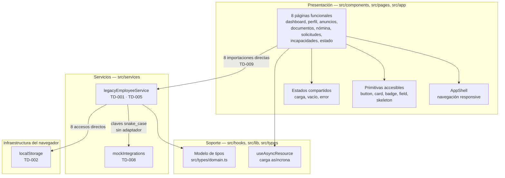
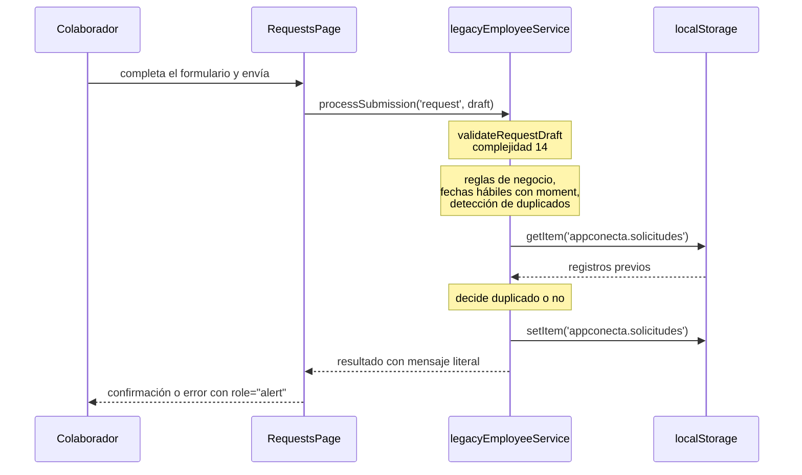
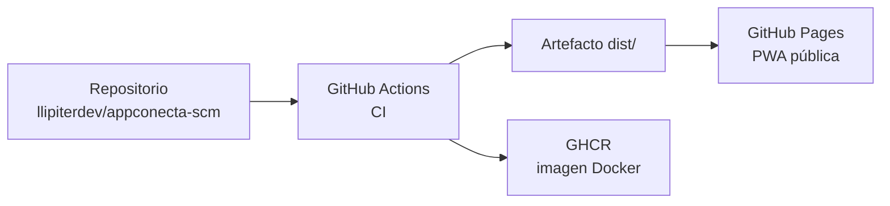

# Arquitectura de la simulación AppConecta

> **Alcance.** Este documento describe la arquitectura de **lo que existe en este
> repositorio**: una Progressive Web App que representa académicamente el cliente móvil de
> AppConecta. No describe la arquitectura de un sistema empresarial en producción. Los cuatro
> sistemas corporativos con los que la aplicación conversa son adaptadores simulados dentro del
> propio código, no servicios externos.

## Decisión de alcance

La Actividad 3 pide evidenciar una estrategia de control de versiones y automatización. Eso no
requiere construir AppConecta completa: requiere construir algo lo bastante real como para que
el pipeline, las baselines y las métricas tengan un objeto verdadero sobre el que operar.

La consecuencia práctica es que el sistema tiene **una sola pieza desplegable**. No hay backend,
no hay base de datos, no hay microservicios. Toda la lógica —incluida la que en un sistema real
viviría en un servidor— reside en el cliente, y la persistencia usa `localStorage`. Esta decisión
está registrada en `docs/adr/0001-simulation-scope.md`.

## Vista de componentes

El diagrama muestra deliberadamente las deudas donde ocurren. Dos flechas merecen atención
porque son el objeto de la intervención de la Actividad 4:

- La presentación llama al servicio legacy **sin capa intermedia**. No hay dónde ubicar una
  regla de negocio que no sea dentro del servicio (TD-009).
- El servicio legacy llama a `localStorage` **desde dentro de las reglas de negocio**. La regla
  y su almacenamiento son la misma línea de código (TD-002).

Falta, a propósito, la capa que debería estar entre ellas: un dominio con casos de uso y puertos.

## Capas presentes y capa ausente

| Capa                | Ubicación                                | Responsabilidad declarada                              | Estado                 |
| ------------------- | ---------------------------------------- | ------------------------------------------------------ | ---------------------- |
| Presentación        | `src/app`, `src/components`, `src/pages` | Composición visual, navegación, estados de interacción | Presente               |
| Soporte transversal | `src/hooks`, `src/lib`, `src/types`      | Carga asíncrona, utilidades, tipos del modelo          | Presente               |
| **Dominio**         | —                                        | Reglas de negocio, casos de uso, puertos               | **Ausente (TD-009)**   |
| Servicios / datos   | `src/services`                           | Integración simulada, transformación, persistencia     | Presente, sobrecargada |

La tabla es el resumen honesto de la arquitectura: dos capas de tres, y la tercera colapsada
dentro de la cuarta.

## Flujo de una operación de escritura

El registro de una solicitud de Recursos Humanos recorre todo el sistema y muestra por qué la
complejidad se concentra en un punto.

Todo lo anotado sobre `legacyEmployeeService` en este diagrama ocurre dentro de **una sola
función** de 204 líneas y complejidad ciclomática 26. Validación, cálculo de fechas, consulta de
duplicados, persistencia y redacción del mensaje no están separados ni siquiera en funciones
distintas.

## Integraciones simuladas

`src/services/mockIntegrations.ts` expone cuatro contratos que imitan la forma que tendrían los
sistemas corporativos heredados descritos en el diagnóstico de la Actividad 1.

| Contrato simulado  | Sistema que representa     | Forma expuesta                                         |
| ------------------ | -------------------------- | ------------------------------------------------------ |
| Directorio         | Autenticación y RRHH       | `cod_empleado`, `nombre_completo`, claves `snake_case` |
| Gestión documental | Repositorio de documentos  | Fechas `DD/MM/YYYY`, códigos de estado numéricos       |
| Nómina             | Sistema de nómina          | Importes como cadena de texto                          |
| Comunicaciones     | Portal de noticias interno | Categorías como códigos numéricos                      |

Ninguno de los cuatro realiza una llamada de red. Son funciones que devuelven datos ficticios
tras una demora simulada. **No deben presentarse como integraciones implementadas**: aparecen en
el inventario de Configuration Items clasificados como conceptuales, y la interfaz de la
aplicación lo declara mediante un aviso permanente.

## Arquitectura de despliegue

Dos destinos de despliegue para un mismo build: GitHub Pages sirve la aplicación al usuario y
GHCR publica la imagen del contenedor como artefacto versionado de la baseline. Ninguno requiere
secretos externos ni infraestructura propia, lo que hace el despliegue reproducible por cualquier
integrante del equipo. El detalle vive en `docs/ci-cd.md`.

## Decisiones tecnológicas

| Decisión                            | Alternativa descartada             | Razón                                                                                                             |
| ----------------------------------- | ---------------------------------- | ----------------------------------------------------------------------------------------------------------------- |
| PWA con React y TypeScript          | Aplicación nativa Android/iOS      | Una PWA se despliega en GitHub Pages y se verifica desde el navegador; una app nativa exigiría tiendas y firmas   |
| `localStorage` como persistencia    | Base de datos real                 | El alcance académico no requiere un backend, y el acoplamiento resultante es deuda medible y útil (TD-002)        |
| Adaptadores simulados en código     | Servidor de mocks                  | Elimina dependencia de infraestructura y mantiene la reproducibilidad del pipeline                                |
| Vite como herramienta de build      | Configuración manual               | Build de producción reproducible con base path configurable, requisito para publicar en un subdirectorio de Pages |
| Tailwind CSS con primitivas propias | Biblioteca de componentes completa | Las primitivas accesibles necesarias son pocas; una dependencia mayor añadiría superficie sin valor demostrativo  |

## Accesibilidad

La accesibilidad básica es un requisito, no un objetivo opcional, y no se sacrifica para
materializar deuda. Lo implementado:

- Estructura semántica con `header`, `nav`, `main` y encabezados jerárquicos. La navegación
  secundaria se ubica **fuera** de `<main>`, porque los enlaces de navegación no son contenido
  principal.
- Cada campo de formulario tiene etiqueta asociada; los errores se comunican con `aria-invalid`
  y `role="alert"`, no solo con color.
- Navegación por teclado en todos los controles interactivos, con foco visible.
- La ruta activa se anuncia con `aria-current`.

## Relación con los Configuration Items

Cada componente de esta arquitectura corresponde a un Configuration Item identificado y
versionado. La correspondencia completa está en `docs/configuration-items.md`.
