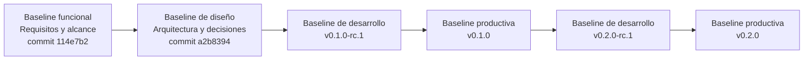
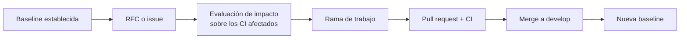

# Baselines — AppConecta

Una baseline es una configuración aprobada, identificada de forma unívoca y que solo puede
modificarse mediante el proceso formal de control de cambios. Su valor no está en congelar el
trabajo, sino en dar una referencia estable contra la cual medir todo lo que ocurre después.

Este documento materializa las cuatro baselines definidas en la estrategia SCM de la Actividad 2
y las asocia a identificadores verificables de Git.

## Principio de identificación

Cada baseline se identifica mediante un **commit SHA real y publicado**. No se crean tags
decorativos: un tag existe cuando aporta un punto de recuperación o una entrega, no para adornar
el historial.

Las baselines funcional y de diseño se identifican **por commit**, porque son estados de la
documentación, no entregables ejecutables. Las baselines de desarrollo y productiva se
identifican **por tag anotado**, porque representan artefactos que se construyen, despliegan y
podrían necesitar recuperarse.

## Cadena de baselines

---

## 1. Baseline funcional

**Contenido:** requisitos aceptados y alcance aprobado de la simulación.

| Atributo                   | Valor                                                                                  |
| -------------------------- | -------------------------------------------------------------------------------------- |
| Identificador              | `BL-FUNC-001`                                                                          |
| Commit                     | `114e7b2` — `chore(project): initialize AppConecta SCM repository`                     |
| Rama                       | `main`                                                                                 |
| Artefactos que la componen | `README.md` (declaración de alcance y naturaleza simulada), `LICENSE`, issues #1 a #9  |
| Método de aprobación       | Definición de alcance en el commit inicial y apertura de las nueve issues del proyecto |
| Estado                     | **Establecida**                                                                        |

Esta baseline fija dos cosas que ningún cambio posterior puede alterar sin pasar por control de
cambios: **qué** se va a construir (los ocho módulos del portal más el carné virtual) y **qué no**
se afirma que exista (integraciones reales, historia de diez años, datos reales).

El commit inicial no sigue Conventional Commits en su totalidad porque precede a la adopción de
la convención. Se conserva sin reescribir y se registra como excepción histórica documentada en
`docs/conventional-commits.md`.

## 2. Baseline de diseño

**Contenido:** arquitectura acordada y decisiones técnicas registradas.

| Atributo                   | Valor                                                                                           |
| -------------------------- | ----------------------------------------------------------------------------------------------- |
| Identificador              | `BL-DES-001`                                                                                    |
| Commit                     | `a2b8394` — `chore(merge): integrate scm governance and design baseline (#13)`                  |
| Rama de origen             | `feature/scm-governance` → `develop`                                                            |
| Artefactos que la componen | `docs/architecture.md`, `docs/adr/0001` a `0003`, `docs/configuration-items.md`, este documento |
| Método de aprobación       | Pull request #13 con los cuatro checks de CI en verde                                           |
| Estado                     | **Establecida**                                                                                 |

Las tres decisiones que esta baseline congela, y que por tanto requieren un ADR nuevo para
cambiarse:

1. El alcance simulado del sistema y el uso de adaptadores en código en lugar de integraciones
   reales (`ADR-0001`).
2. GitFlow liviano como estrategia de ramas (`ADR-0002`).
3. GitHub Actions, Pages y GHCR como plataforma de automatización (`ADR-0003`).

## 3. Baselines de desarrollo

**Contenido:** código candidato a liberación, verificado por el pipeline completo.

| Identificador | Tag           | Origen          | Propósito                                                                     | Estado      |
| ------------- | ------------- | --------------- | ----------------------------------------------------------------------------- | ----------- |
| `BL-DEV-001`  | `v0.1.0-rc.1` | `release/0.1.0` | Congelar el código candidato antes de la aprobación de la primera entrega     | Establecida |
| `BL-DEV-002`  | `v0.2.0-rc.1` | `release/0.2.0` | Congelar el código candidato con el carné virtual antes de la segunda entrega | Pendiente   |

Estas baselines aportan algo que el commit de la rama de release no aporta por sí solo: un punto
de recuperación con nombre. Si la validación final de una entrega falla, la corrección parte de un
estado identificado y verificado, no de "el último commit que parecía estar bien".

Las ramas `release/*` **no se eliminan** hasta que la evidencia de la entrega esté recopilada.

## 4. Baselines productivas

**Contenido:** versión formalmente liberada, con todos sus artefactos de entrega.

| Identificador | Tag      | Contenido funcional                                                         | Artefactos asociados                                                | Estado      |
| ------------- | -------- | --------------------------------------------------------------------------- | ------------------------------------------------------------------- | ----------- |
| `BL-PROD-001` | `v0.1.0` | Ocho módulos del portal, deuda TD-001 a TD-009 medida, pipeline CI completo | GitHub Release, artefacto `dist/`, imagen de contenedor             | Establecida |
| `BL-PROD-002` | `v0.2.0` | Carné virtual QR, modelo SCM implementado, CI/CD funcional                  | GitHub Release, `dist/`, imagen en GHCR, despliegue en GitHub Pages | Pendiente   |

Una baseline productiva se considera establecida únicamente cuando **todos** sus artefactos
existen y son verificables. Un tag sin release, o un release sin despliegue verificado, es una
baseline incompleta y así debe declararse.

Artefactos verificados de `BL-PROD-001`:

| Artefacto            | Identificación                                                                      |
| -------------------- | ----------------------------------------------------------------------------------- |
| Merge commit         | `878c94b` en `main`, procedente del PR #15                                          |
| Tag anotado          | `v0.1.0`, con las métricas medidas en el propio mensaje del tag                     |
| GitHub Release       | [v0.1.0](https://github.com/llipiterdev/appconecta-scm/releases/tag/v0.1.0)         |
| Artefacto de build   | `appconecta-v0.1.0-dist.zip`, adjunto al release                                    |
| Suma de verificación | SHA-256 `9bd3ccd5915bceea259d62221ce683faf12aef25dd59a85ac56f9e3113b921c1`          |
| Imagen de contenedor | Construida y verificada en CI y en local; su publicación en GHCR llega con `v0.2.0` |

La imagen todavía no se publica en un registro. `BL-PROD-001` es por tanto una baseline
**completa para su alcance**: la publicación en GHCR y el despliegue pertenecen al pipeline de
entrega, que forma parte de la siguiente versión. Declararla desplegada hoy sería falso.

`BL-PROD-001` es además la **baseline de mantenimiento**: el estado medido contra el cual la
Actividad 4 comparará el efecto de la refactorización. Sus métricas viven en
`docs/technical-debt-register.md` y su matriz antes/después en `docs/maintenance-baseline.md`.

---

## Composición de la baseline productiva v0.1.0

Los Configuration Items que quedan congelados en la primera entrega:

| Ámbito                | CI incluidos                                               |
| --------------------- | ---------------------------------------------------------- |
| Aplicación            | `CI-APP-*` (11 CI)                                         |
| Configuración técnica | `CI-CFG-*` (12 CI), incluido `package-lock.json`           |
| Pruebas               | `CI-TST-*`                                                 |
| Automatización        | `CI-PIPE-CI-001`, `CI-PIPE-METRIC-001`, `CI-PIPE-RULE-001` |
| Documentación         | `CI-DOC-*` de las fases de gobierno y CI                   |
| Entrega               | `CI-REL-CHG-001`, `CI-REL-TAG-001`, `CI-REL-DIST-001`      |

La inclusión de `package-lock.json` es deliberada y no accesoria. Sin las versiones exactas
congeladas, la comparación de métricas de la Actividad 4 no podría distinguir el efecto de la
refactorización del efecto de una actualización de dependencias ocurrida entre medias.

## Cambios sobre una baseline establecida

Una vez establecida, una baseline no se modifica. Los cambios se incorporan en la **siguiente**
baseline mediante el proceso de `docs/change-control.md`:

Nunca se reescribe el historial publicado, ni se mueve un tag existente, ni se fuerza el push
sobre una rama permanente. Un tag que apunta a un commit distinto del que apuntaba ayer destruye
la propiedad que justifica la existencia de las baselines.

## Registro de establecimiento

| Baseline      | Fecha de establecimiento | Identificador Git | Aprobación            | Evidencia                 |
| ------------- | ------------------------ | ----------------- | --------------------- | ------------------------- |
| `BL-FUNC-001` | 21 de agosto de 2026     | `114e7b2`         | Definición de alcance | Commit inicial en `main`  |
| `BL-DES-001`  | 22 de agosto de 2026     | `a2b8394`         | PR #13 a `develop`    | Merge commit en `develop` |
| `BL-DEV-001`  | 22 de agosto de 2026     | `1a5f6cc`         | Pipeline completo     | Tag anotado `v0.1.0-rc.1` |
| `BL-PROD-001` | 22 de agosto de 2026     | `878c94b`         | PR #15 a `main`       | Tag `v0.1.0` y release    |
| `BL-DEV-002`  | _pendiente_              | `v0.2.0-rc.1`     | Pipeline completo     | _pendiente_               |
| `BL-PROD-002` | _pendiente_              | `v0.2.0`          | PR a `main` + release | _pendiente_               |

Las filas pendientes se completan **cuando el identificador existe**, no antes. Anticipar un SHA
o una fecha sería fabricar evidencia.
