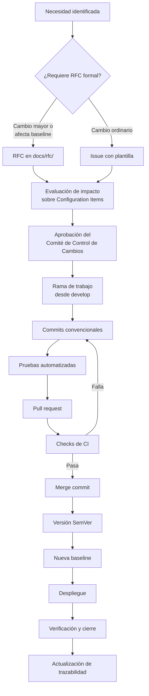

# Control de cambios — AppConecta

El control de cambios es el mecanismo por el que una modificación pasa de ser una idea a ser
parte de una baseline, dejando en cada paso una evidencia verificable de quién decidió qué y con
qué justificación.

En este proyecto el proceso no es un documento aparte del trabajo: **está implementado en la
plataforma**. Las reglas no se cumplen por disciplina, se cumplen porque GitHub las hace cumplir.

## Proceso completo

Cada paso deja un artefacto consultable: la issue o el RFC, la rama, los commits, el pull
request, el registro de ejecución del pipeline, el merge commit, el tag y la entrada en la matriz
de trazabilidad.

## Niveles de cambio

| Nivel                    | Cuándo aplica                                                                   | Autorización requerida                                  | Registro                       | Ejemplos en este proyecto                             |
| ------------------------ | ------------------------------------------------------------------------------- | ------------------------------------------------------- | ------------------------------ | ----------------------------------------------------- |
| **Cambio menor**         | Documentación, formato, ajustes sin efecto funcional ni sobre CI críticos       | Pull request con CI en verde                            | Issue opcional; PR obligatorio | Corrección de redacción, ajuste de formato            |
| **Cambio estándar**      | Nueva funcionalidad, modificación de un CI bajo baseline, cambio en el pipeline | Issue previa + pull request + CI en verde               | Issue y PR obligatorios        | Los ocho módulos del portal (#2), el pipeline CI (#4) |
| **Cambio mayor**         | Afecta la arquitectura, el alcance o varios CI críticos                         | RFC formal + evaluación de impacto + aprobación del CCB | RFC, issue y PR obligatorios   | Carné virtual QR (RFC-001, issue #5)                  |
| **Cambio de emergencia** | Defecto en producción que exige respuesta inmediata                             | Aprobación posterior documentada; rama `hotfix/*`       | Issue retroactiva obligatoria  | **Ninguno registrado**                                |

Sobre la última fila: **no se ha producido ningún cambio de emergencia en este proyecto**. La
categoría se define porque el modelo de control de cambios debe contemplarla, y la rama `hotfix/*`
existe en la estrategia por la misma razón. Inventar un incidente productivo para demostrar el
uso de `hotfix/*` sería fabricar evidencia. Si durante la ejecución aparece un defecto real en
`main`, se tratará por esta vía y se documentará entonces.

## Evaluación de impacto

Todo cambio estándar o mayor declara, antes de implementarse, su efecto sobre la configuración.
La plantilla de pull request (`.github/PULL_REQUEST_TEMPLATE.md`) obliga a responder:

| Dimensión           | Pregunta que debe responderse                                       |
| ------------------- | ------------------------------------------------------------------- |
| Configuration Items | ¿Qué CI se modifican, se crean o cambian de estado?                 |
| Baselines           | ¿Afecta a una baseline establecida? ¿Cuál será la siguiente?        |
| Versión             | Según SemVer, ¿es PATCH, MINOR o MAJOR?                             |
| Deuda técnica       | ¿Introduce deuda nueva? Si es así, ¿con qué identificador `TD-xxx`? |
| Pruebas             | ¿Qué pruebas verifican el cambio?                                   |
| Riesgo              | ¿Qué puede romperse y cómo se detectaría?                           |
| Reversión           | ¿Cómo se deshace el cambio si falla?                                |

## Implementación técnica del control

Lo que hace que este proceso sea auditable y no meramente declarado:

| Control                                       | Mecanismo                                                  | Efecto verificable                                        |
| --------------------------------------------- | ---------------------------------------------------------- | --------------------------------------------------------- |
| Ningún cambio directo sobre ramas permanentes | Rulesets de `main` y `develop`                             | El push directo es rechazado por la plataforma            |
| Todo cambio pasa por pull request             | Ruleset con pull request obligatorio                       | No existe forma de integrar sin PR                        |
| Toda integración está validada                | Status checks obligatorios en el ruleset                   | Un PR con CI en rojo no puede fusionarse                  |
| El historial publicado es inmutable           | Prohibición de force-push y de borrado de ramas            | Ni el historial ni las ramas permanentes pueden alterarse |
| La integración es rastreable                  | Merge commits obligatorios; squash y rebase deshabilitados | Cada integración conserva sus commits individuales        |
| Los mensajes de cambio son interpretables     | commitlint local (hook) y en CI                            | Un commit fuera de convención no llega a `develop`        |
| Las conversaciones se resuelven               | Requisito de conversaciones resueltas                      | Ninguna observación queda abierta al integrar             |

Los rulesets activos son `21182905` (protección de `main`) y `21182906` (protección de
`develop`), ambos con enforcement activo.

## Separación de control con una sola identidad

Toda la ejecución técnica en GitHub se realiza mediante una única identidad. Esto tiene una
consecuencia que conviene declarar sin rodeos, en lugar de disimularla:

> La separación de control se implementó mediante pull request obligatorio, validaciones
> automáticas y protección de ramas. No se exigió una segunda aprobación humana debido al alcance
> académico y a la operación automatizada mediante una única identidad.

No se han inventado revisores, ni aprobaciones humanas, ni conversaciones de revisión que no
ocurrieron. Los pull requests de este repositorio muestran cero aprobaciones humanas, y esa es la
información correcta.

Lo que sí opera de forma independiente del autor es el conjunto de validaciones automáticas: el
pipeline no puede ser complacido por quien escribe el código. Esa es la separación de control
realmente existente, y es la que se reclama.

## El Comité de Control de Cambios

El CCB se modela conforme a la estructura organizacional definida en `docs/raci.md`:

| Rol en el CCB             | Integrante                      | Responsabilidad en la decisión                         |
| ------------------------- | ------------------------------- | ------------------------------------------------------ |
| Representante del cliente | Miguel Santiago Acevedo Virgues | Prioridad y valor para el negocio                      |
| Responsable SCM           | Julian Camilo Corredor Rojas    | Efecto sobre CI, baselines y trazabilidad              |
| Responsable DevOps        | Brayan Estif Calderon Gomez     | Efecto sobre el pipeline, el despliegue y la operación |

La aprobación del CCB se registra en el propio RFC. En este proyecto la decisión es **simulada
dentro del ejercicio académico**: representa cómo operaría la consultora, no una reunión con actas
que haya tenido lugar. La declaración de esta condición es parte del compromiso de honestidad del
proyecto.

## Registro de cambios administrativos

Cambios que afectan a la configuración del proyecto pero **no viven en el árbol de archivos**, por
lo que no pueden aprobarse mediante pull request:

| Fecha      | Cambio                                                    | CI afectado      | Justificación                                                      | Evidencia                     |
| ---------- | --------------------------------------------------------- | ---------------- | ------------------------------------------------------------------ | ----------------------------- |
| 21/08/2026 | Creación del repositorio público                          | —                | Requisito de la Actividad 3                                        | `llipiterdev/appconecta-scm`  |
| 21/08/2026 | Merge commits habilitados; squash y rebase deshabilitados | CI-PIPE-RULE-001 | Preservar la trazabilidad de los commits individuales de cada rama | Configuración del repositorio |
| 21/08/2026 | Creación de 8 labels de clasificación                     | —                | Clasificar issues por tipo de cambio                               | Labels del repositorio        |
| 21/08/2026 | Creación de ruleset de protección de `main`               | CI-PIPE-RULE-001 | Impedir cambios directos sobre las versiones liberadas             | Ruleset `21182905`            |
| 21/08/2026 | Creación de ruleset de protección de `develop`            | CI-PIPE-RULE-001 | Impedir cambios directos sobre la rama de integración              | Ruleset `21182906`            |

### Excepción controlada de bootstrap

Los rulesets se crearon **después** de fusionar el primer pull request, no antes. La razón es
técnica y no admite otro orden: un ruleset que exige un status check obligatorio necesita el
nombre exacto de ese check, y ese nombre no existe hasta que el workflow se ha ejecutado al menos
una vez. Configurar la protección antes habría requerido inventar nombres de checks, con el
resultado previsible de una protección que no protege nada.

La secuencia real fue:

1. `feature/scm-bootstrap` incorpora el scaffold y el workflow de CI.
2. Pull request [#10](https://github.com/llipiterdev/appconecta-scm/pull/10) hacia `develop`; el
   pipeline se ejecuta y los checks reciben sus nombres definitivos.
3. Merge del PR con `develop` aún sin protección.
4. Creación de ambos rulesets con los nombres reales de los cuatro checks.
5. Todos los pull requests posteriores ya operan bajo protección activa.

Se registra como **excepción controlada de bootstrap**, acotada al primer PR del proyecto y
documentada aquí en lugar de omitirse.

## Cierre de un cambio

Un cambio se considera cerrado cuando se cumplen todas estas condiciones, no solo la primera:

- El pull request está fusionado mediante merge commit.
- Los checks de CI pasaron en el commit de integración.
- La issue o el RFC está cerrado con referencia al PR.
- La matriz de trazabilidad refleja los identificadores reales.
- Si el cambio introdujo deuda, existe su registro `TD-xxx` con métrica medida.
- Si el cambio pertenece a una entrega, está incluido en el `CHANGELOG.md` de la versión.
