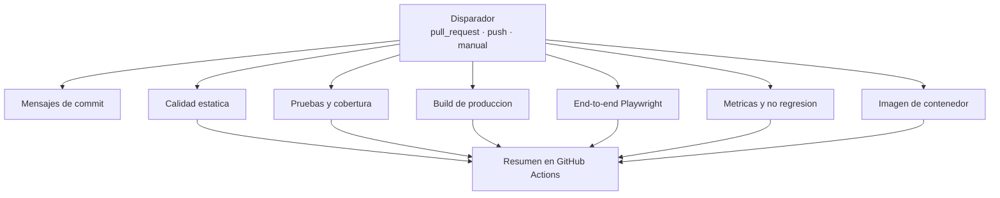
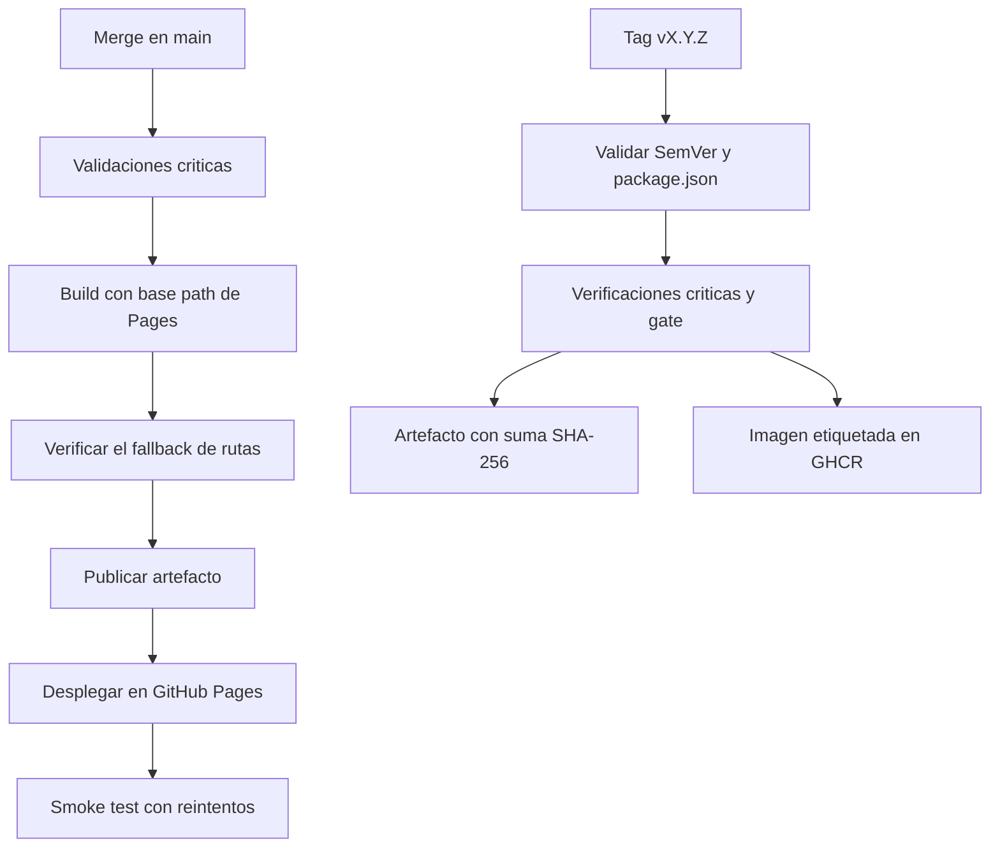

# Integración y despliegue continuo

## Principios de diseño del pipeline

Cuatro decisiones gobiernan todo lo demás:

1. **Sin secretos externos.** El único token utilizado es el `GITHUB_TOKEN` que la plataforma
   provee a cada ejecución. Cualquier integrante puede reproducir el pipeline completo haciendo
   fork del repositorio, sin configurar nada.
2. **Sin runners self-hosted.** Todos los jobs se ejecutan en runners alojados por GitHub. Una
   evidencia que solo puede reproducirse en la máquina de una persona no es una evidencia
   verificable.
3. **Permisos mínimos.** El workflow de CI declara `contents: read` y ningún job amplía ese
   permiso. Un pipeline de validación no necesita escribir en el repositorio.
4. **Ningún control se relaja para obtener un pipeline verde.** El pipeline pasa **con** la deuda
   técnica presente porque la deuda está registrada y medida, no porque se hayan bajado los
   umbrales.

La justificación completa de estas elecciones, y de las alternativas descartadas, está en
`docs/adr/0003-ci-cd-platform.md`.

## Pipeline de integración continua



Los siete jobs se ejecutan **en paralelo**. Ninguno depende del resultado de otro, lo que reduce
el tiempo total y, más importante, hace que un fallo no oculte los demás: si el lint y las pruebas
fallan a la vez, el pull request reporta ambos problemas en la misma ejecución.

### Disparadores

| Evento              | Ramas             | Propósito                                                            |
| ------------------- | ----------------- | -------------------------------------------------------------------- |
| `pull_request`      | `main`, `develop` | Validar antes de integrar; es el control que hace cumplir el ruleset |
| `push`              | `main`, `develop` | Verificar el estado de las ramas permanentes tras cada merge         |
| `workflow_dispatch` | cualquiera        | Ejecución manual para recopilar evidencias                           |

La política de `concurrency` cancela ejecuciones anteriores de la misma referencia. Validar un
commit que ya ha sido reemplazado consume tiempo sin aportar información.

### Jobs

| Job                                    | Verifica                                                              | Artefactos publicados |
| -------------------------------------- | --------------------------------------------------------------------- | --------------------- |
| **Mensajes de commit**                 | Conventional Commits en todos los commits del pull request            | —                     |
| **Calidad estática**                   | Formato con Prettier, ESLint y verificación de tipos de TypeScript    | —                     |
| **Pruebas unitarias y de componentes** | Suite de Vitest con cobertura                                         | `coverage/`           |
| **Build de producción**                | Compilación de producción y tamaño del artefacto                      | `dist/`               |
| **Pruebas end-to-end**                 | Flujos críticos en móvil y escritorio contra el build de producción   | Reporte HTML y trazas |
| **Métricas y no regresión**            | Auditoría, complejidad, duplicación, cobertura y control de baseline  | `reports/`            |
| **Imagen de contenedor**               | Build multi-stage y verificación de que la imagen sirve la aplicación | —                     |

El job de mensajes de commit solo se ejecuta en pull requests, porque necesita el rango de commits
entre la base y la cabeza para validar.

### Verificación del contenedor

El job de contenedor no se limita a construir la imagen. Construir una imagen demuestra que el
`Dockerfile` es sintácticamente válido, no que el resultado funcione. El job arranca el contenedor
y consulta la aplicación con reintentos hasta doce veces, con cinco segundos entre intentos. Si no
responde, publica los logs del contenedor antes de fallar.

### Pruebas end-to-end

Los flujos críticos se ejecutan contra el **build de producción** servido por `vite preview`, no
contra el servidor de desarrollo. Verificar un artefacto distinto del que se despliega no
demostraría nada sobre el artefacto desplegado.

Cada flujo se ejecuta en dos proyectos, móvil y escritorio, porque el layout responsive presenta
navegaciones distintas: barra inferior con etiquetas cortas en móvil, barra lateral con etiquetas
completas en escritorio. Un flujo que funciona en uno puede estar roto en el otro.

| Flujo verificado                                        | Requisito    |
| ------------------------------------------------------- | ------------ |
| El aviso de simulación académica es visible             | —            |
| El dashboard carga el resumen del colaborador           | RF-01        |
| La navegación conduce a la sección seleccionada         | RF-09        |
| La consulta de documentos permite filtrar por categoría | RF-04        |
| La consulta de nómina muestra los importes              | RF-05        |
| El colaborador registra una solicitud de RRHH           | RF-06        |
| Una solicitud incompleta comunica el error accesible    | RF-12, RF-14 |
| El colaborador registra una incapacidad                 | RF-07        |
| El estado de solicitudes refleja los trámites           | RF-08        |
| El colaborador visualiza el carné virtual y su QR       | RF-16        |
| Una ruta inexistente presenta la página de error        | RF-12        |

## Control de no regresión de métricas

Este es el mecanismo que distingue una deuda gestionada de una deuda que crece. La deuda
registrada **puede permanecer**: está documentada y reservada para la Actividad 4. Lo que no puede
ocurrir es que empeore en silencio.

`metrics-baseline.json` guarda los valores medidos de la versión v0.1.0 y
`scripts/metrics-gate.mjs` compara cada ejecución contra ellos.

| Dimensión                          | Baseline | Tolerancia | Justificación de la tolerancia                                              |
| ---------------------------------- | -------- | ---------- | --------------------------------------------------------------------------- |
| Cobertura (cuatro indicadores)     | Medida   | 1 punto    | Absorbe código nuevo cubierto de forma desigual, sin degradación apreciable |
| Complejidad ciclomática máxima     | 26       | **0**      | TD-005 está reservada: puede permanecer, no crecer                          |
| Líneas del archivo mayor           | 580      | **0**      | TD-001 está reservada, con el mismo criterio                                |
| Duplicación                        | 0,77 %   | 0,5 puntos | Permite mover código sin abrir la puerta a duplicación nueva                |
| Vulnerabilidades `high`/`critical` | 0        | **0**      | Ninguna deuda del proyecto justifica una vulnerabilidad                     |

Tres de las cinco dimensiones tienen tolerancia cero. La elección no es arbitraria: son
exactamente las dimensiones sobre las que la Actividad 4 debe demostrar una mejora. Si la
complejidad pudiera crecer entre medias, la comparación antes/después mediría el ruido acumulado en
lugar del efecto de la refactorización.

El script falla con el detalle de cada indicador degradado, y su mensaje indica la única vía
legítima para superarlo: actualizar la baseline de forma explícita y documentar la razón en el
registro de deuda. No hay forma de silenciarlo.

## Recopilación reproducible de evidencias

`npm run evidence` ejecuta las trece validaciones del proyecto y produce `reports/evidence/` con
el resultado real de cada una, la fecha, el commit SHA, la versión y las métricas medidas.

Reglas de diseño del script:

- **Falla si una validación obligatoria falla.** Un informe de evidencias que oculta un fallo no es
  evidencia.
- **No fabrica ni corrige salidas.** Registra lo que ocurrió.
- **Excluye credenciales.** La URL del remoto se publica con la parte de autenticación eliminada,
  porque un remoto puede llevar un token embebido.
- Las validaciones que dependen del entorno local (end-to-end y Docker) se marcan como opcionales:
  si no pueden ejecutarse, se registra el aviso en lugar de fingir que pasaron.

## Herramientas y su función

| Función           | Herramienta                          | Ejecución                     |
| ----------------- | ------------------------------------ | ----------------------------- |
| Formato           | Prettier                             | `npm run format:check`        |
| Análisis estático | ESLint con `typescript-eslint`       | `npm run lint`                |
| Tipos             | TypeScript en modo `--noEmit`        | `npm run typecheck`           |
| Pruebas unitarias | Vitest y Testing Library             | `npm run test`                |
| Cobertura         | Vitest con proveedor v8              | `npm run test:coverage`       |
| End-to-end        | Playwright                           | `npm run test:e2e`            |
| Complejidad       | ESLint con configuración de medición | `npm run metrics:complexity`  |
| Duplicación       | jscpd                                | `npm run metrics:duplication` |
| Vulnerabilidades  | `npm audit --audit-level=high`       | `npm run metrics:audit`       |
| No regresión      | Script propio                        | `npm run metrics:gate`        |
| Evidencias        | Script propio                        | `npm run evidence`            |
| Contenedor        | Docker multi-stage con nginx         | `docker build .`              |

## Imagen de contenedor

Build multi-stage con dos etapas y un resultado deliberadamente mínimo:

| Etapa        | Base                                      | Contenido                           |
| ------------ | ----------------------------------------- | ----------------------------------- |
| `builder`    | `node:24-alpine`                          | Dependencias, código fuente y build |
| `production` | `nginxinc/nginx-unprivileged:1.29-alpine` | Solo los archivos estáticos y nginx |

La imagen final **no contiene** Node, ni dependencias de npm, ni código fuente. Todo eso vive en la
etapa que se descarta. El contenedor escucha en el puerto 8080 y se ejecuta como `uid 101`, sin
privilegios de root.

La variante `nginx-unprivileged` no fue la elección inicial y el cambio salió de un fallo real. Con
la imagen oficial `nginx:alpine` y la directiva `USER nginx`, el contenedor se construía pero el
proceso terminaba al arrancar: nginx necesita escribir su PID y sus directorios de caché en rutas
que solo root puede crear. El job de verificación lo detectó porque no se limita a construir la
imagen, sino que la ejecuta y la consulta.

El mismo fallo dejó al descubierto una carencia del propio job. Arrancaba el contenedor con
`docker run --rm`, de modo que al terminar el contenedor desaparecía y `docker logs` no encontraba
nada que mostrar justo cuando hacía falta. El paso ya no usa `--rm`, publica el estado y el código
de salida, y comprueba además una ruta profunda para verificar el fallback de la SPA.

La configuración de nginx resuelve tres cuestiones que un servidor estático por defecto haría mal
para una SPA:

- Cualquier ruta desconocida se resuelve en `index.html`, para que el enrutado del cliente
  funcione en lugar de devolver 404 desde el servidor.
- El service worker y el manifiesto se sirven sin caché. Una versión antigua de `sw.js` en caché
  impediría que el usuario recibiera actualizaciones, y el problema sería difícil de diagnosticar.
- Los assets con hash en el nombre se sirven con caché de un año, porque su nombre cambia cuando su
  contenido cambia.

## Verificación local antes de abrir un pull request

```bash
npm ci
npm run format:check
npm run lint
npm run typecheck
npm run test:coverage
npm run build
npm run test:e2e
npm run metrics
npm run metrics:gate
```

Los hooks de Husky ejecutan `lint-staged` antes de cada commit y `commitlint` sobre el mensaje. Esa
validación local es una comodidad, no un control: puede saltarse con `--no-verify`. El control real
es el pipeline, que no depende de la configuración de ninguna máquina.

## Despliegue continuo

Dos workflows con disparadores distintos, porque responden a preguntas distintas: uno mantiene la
demostración accesible, el otro produce los artefactos de una entrega formal.



### Despliegue en GitHub Pages

| Aspecto      | Configuración                                                                                 |
| ------------ | --------------------------------------------------------------------------------------------- |
| Disparador   | `push` a `main` y ejecución manual                                                            |
| Entorno      | `github-pages`, con la URL registrada en la propia ejecución                                  |
| Permisos     | `contents: read` por defecto; `pages: write` e `id-token: write` solo en el job de despliegue |
| Concurrencia | Grupo `pages`, **sin** cancelación en curso                                                   |
| URL          | <https://llipiterdev.github.io/appconecta-scm/>                                               |

Cuatro decisiones merecen explicación.

**Se revalida antes de desplegar**, aunque el pull request ya haya pasado por CI. El artefacto que
llega al usuario debe construirse desde un árbol verificado, no desde la confianza en que alguien
lo verificó antes.

**Los despliegues no se cancelan entre sí.** A diferencia de una validación, cancelar un despliegue
en curso puede dejar el entorno a medias, y quien lo esté viendo verá el resultado intermedio.

**El base path se inyecta en construcción.** Pages sirve el proyecto desde un subdirectorio y Vite
incrusta esa ruta en los assets generados: no es algo que el servidor pueda corregir después.

**El fallback de rutas se verifica, no se genera.** `public/404.html` redirige la ruta solicitada al
índice conservándola como parámetro, y `src/app/spaRedirect.ts` la restaura al arrancar. El
workflow comprueba que ese archivo viaja en el artefacto; sustituirlo por una copia de `index.html`
rompería la cadena y un enlace directo a una sección aterrizaría en el inicio.

### Smoke test del despliegue

Un despliegue que reporta éxito no demuestra que la aplicación responda. El smoke test consulta la
URL publicada y exige dos condiciones: código 200 **y** contenido de AppConecta en la respuesta. Un
200 por sí solo lo devolvería también una página de error de la plataforma.

Reintenta hasta diez veces con quince segundos de espera, porque la propagación en Pages no es
inmediata y fallar al primer intento reportaría una condición transitoria como un defecto.

### Publicación de versión por tag

Se dispara con tags de versión liberada y encadena tres jobs, con el de verificación como puerta.

El filtro es `v[0-9]+.[0-9]+.[0-9]+`, no `v*.*.*`, y la diferencia no es cosmética. El primer patrón
que se escribió era el segundo, y al etiquetar la baseline de desarrollo `v0.2.0-rc.1` el workflow
se disparó y falló: comparó `0.2.0-rc.1` contra el `0.2.0` de `package.json` y las declaró
discrepantes. La comprobación hizo su trabajo; el defecto estaba en el disparador.

Un tag de candidato identifica una **baseline de desarrollo**, no una entrega. No debe producir un
release ni publicar una imagen, porque nada de eso se libera al cliente. El patrón exige ahora que
el ref termine en el número de parche, con lo que cualquier sufijo de pre-release queda fuera. La
ejecución fallida se conserva en el historial de Actions como evidencia del defecto y su
corrección.

| Job         | Responsabilidad                                                        |
| ----------- | ---------------------------------------------------------------------- |
| `verify`    | Formato SemVer, coincidencia con `package.json`, verificaciones y gate |
| `artifact`  | Empaquetado del build con su suma SHA-256, adjuntado al release        |
| `container` | Imagen etiquetada por versión, por `major.minor` y por commit, en GHCR |

La comprobación de que el tag coincide con `package.json` va **antes que nada**. Un release cuyo
tag dice una versión y cuyo artefacto dice otra es imposible de rastrear, y es el error más fácil
de cometer al liberar y el más caro de descubrir después.

Los artefactos se publican con su suma de verificación. Sin ella, el archivo adjunto es solo un
archivo con un nombre de versión: nada permite comprobar que lo descargado es lo que produjo el
pipeline.

### Repetición de una publicación

El workflow admite además ejecución manual con el tag como parámetro. La razón salió de un segundo
fallo real: en la publicación de v0.2.0, el job de verificación ejecutaba el control de no regresión
**sin haber generado antes las mediciones**, de modo que el script no encontraba el resumen de
cobertura y fallaba. El tag ya estaba publicado y el release creado, pero sin artefactos.

La salida cómoda habría sido mover el tag para volver a disparar el workflow. Se descartó: un tag
que se mueve deja de identificar una baseline, que es justamente lo único que un tag aporta. La
entrada manual permite repetir la publicación sobre el tag existente, y los tres jobs extraen el
árbol del tag en lugar del de la rama, porque verificar una versión contra un código que no es el
suyo no verifica nada.

Ese es también el motivo de que las etiquetas de la imagen se deriven de la versión verificada y no
del ref del evento: en una ejecución manual el ref es la rama, y dejar que la acción lo dedujera
produciría una imagen etiquetada `main`.

### Ausencia de secretos externos

Ninguno de los dos workflows requiere configurar un secreto. La autenticación contra GHCR usa el
`GITHUB_TOKEN` que la plataforma emite para cada ejecución, y el despliegue en Pages usa OIDC
mediante `id-token: write`. Cualquier integrante puede hacer fork del repositorio y obtener el
mismo comportamiento sin intervención previa, que es la condición que hace reproducible la
evidencia.
