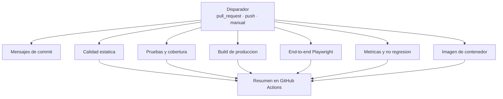

# Integración y despliegue continuo

## Principios de diseño del pipeline

Cuatro decisiones gobiernan todo lo demás:

1. **Sin secretos externos.** El único token utilizado es el `GITHUB_TOKEN` que la plataforma
   provee a cada ejecución. Cualquier integrante puede reproducir el pipeline completo haciendo
   fork del repositorio, sin configurar nada.
2. **Sin runners self-hosted.** Todos los jobs se ejecutan en runners alojados por GitHub. Una
   evidencia que solo puede reproducirse en la máquina de una persona no es una evidencia
   verificable.
3. **Permisos mínimos.** El workflow de CI declara `contents: read` y ningún job amplía ese
   permiso. Un pipeline de validación no necesita escribir en el repositorio.
4. **Ningún control se relaja para obtener un pipeline verde.** El pipeline pasa **con** la deuda
   técnica presente porque la deuda está registrada y medida, no porque se hayan bajado los
   umbrales.

La justificación completa de estas elecciones, y de las alternativas descartadas, está en
`docs/adr/0003-ci-cd-platform.md`.

## Pipeline de integración continua



Los siete jobs se ejecutan **en paralelo**. Ninguno depende del resultado de otro, lo que reduce
el tiempo total y, más importante, hace que un fallo no oculte los demás: si el lint y las pruebas
fallan a la vez, el pull request reporta ambos problemas en la misma ejecución.

### Disparadores

| Evento              | Ramas             | Propósito                                                            |
| ------------------- | ----------------- | -------------------------------------------------------------------- |
| `pull_request`      | `main`, `develop` | Validar antes de integrar; es el control que hace cumplir el ruleset |
| `push`              | `main`, `develop` | Verificar el estado de las ramas permanentes tras cada merge         |
| `workflow_dispatch` | cualquiera        | Ejecución manual para recopilar evidencias                           |

La política de `concurrency` cancela ejecuciones anteriores de la misma referencia. Validar un
commit que ya ha sido reemplazado consume tiempo sin aportar información.

### Jobs

| Job                                    | Verifica                                                              | Artefactos publicados |
| -------------------------------------- | --------------------------------------------------------------------- | --------------------- |
| **Mensajes de commit**                 | Conventional Commits en todos los commits del pull request            | —                     |
| **Calidad estática**                   | Formato con Prettier, ESLint y verificación de tipos de TypeScript    | —                     |
| **Pruebas unitarias y de componentes** | Suite de Vitest con cobertura                                         | `coverage/`           |
| **Build de producción**                | Compilación de producción y tamaño del artefacto                      | `dist/`               |
| **Pruebas end-to-end**                 | Flujos críticos en móvil y escritorio contra el build de producción   | Reporte HTML y trazas |
| **Métricas y no regresión**            | Auditoría, complejidad, duplicación, cobertura y control de baseline  | `reports/`            |
| **Imagen de contenedor**               | Build multi-stage y verificación de que la imagen sirve la aplicación | —                     |

El job de mensajes de commit solo se ejecuta en pull requests, porque necesita el rango de commits
entre la base y la cabeza para validar.

### Verificación del contenedor

El job de contenedor no se limita a construir la imagen. Construir una imagen demuestra que el
`Dockerfile` es sintácticamente válido, no que el resultado funcione. El job arranca el contenedor
y consulta la aplicación con reintentos hasta doce veces, con cinco segundos entre intentos. Si no
responde, publica los logs del contenedor antes de fallar.

### Pruebas end-to-end

Los flujos críticos se ejecutan contra el **build de producción** servido por `vite preview`, no
contra el servidor de desarrollo. Verificar un artefacto distinto del que se despliega no
demostraría nada sobre el artefacto desplegado.

Cada flujo se ejecuta en dos proyectos, móvil y escritorio, porque el layout responsive presenta
navegaciones distintas: barra inferior con etiquetas cortas en móvil, barra lateral con etiquetas
completas en escritorio. Un flujo que funciona en uno puede estar roto en el otro.

| Flujo verificado                                        | Requisito    |
| ------------------------------------------------------- | ------------ |
| El aviso de simulación académica es visible             | —            |
| El dashboard carga el resumen del colaborador           | RF-01        |
| La navegación conduce a la sección seleccionada         | RF-09        |
| La consulta de documentos permite filtrar por categoría | RF-04        |
| La consulta de nómina muestra los importes              | RF-05        |
| El colaborador registra una solicitud de RRHH           | RF-06        |
| Una solicitud incompleta comunica el error accesible    | RF-12, RF-14 |
| El colaborador registra una incapacidad                 | RF-07        |
| El estado de solicitudes refleja los trámites           | RF-08        |
| Una ruta inexistente presenta la página de error        | RF-12        |

## Control de no regresión de métricas

Este es el mecanismo que distingue una deuda gestionada de una deuda que crece. La deuda
registrada **puede permanecer**: está documentada y reservada para la Actividad 4. Lo que no puede
ocurrir es que empeore en silencio.

`metrics-baseline.json` guarda los valores medidos de la versión v0.1.0 y
`scripts/metrics-gate.mjs` compara cada ejecución contra ellos.

| Dimensión                          | Baseline | Tolerancia | Justificación de la tolerancia                                              |
| ---------------------------------- | -------- | ---------- | --------------------------------------------------------------------------- |
| Cobertura (cuatro indicadores)     | Medida   | 1 punto    | Absorbe código nuevo cubierto de forma desigual, sin degradación apreciable |
| Complejidad ciclomática máxima     | 26       | **0**      | TD-005 está reservada: puede permanecer, no crecer                          |
| Líneas del archivo mayor           | 580      | **0**      | TD-001 está reservada, con el mismo criterio                                |
| Duplicación                        | 0,77 %   | 0,5 puntos | Permite mover código sin abrir la puerta a duplicación nueva                |
| Vulnerabilidades `high`/`critical` | 0        | **0**      | Ninguna deuda del proyecto justifica una vulnerabilidad                     |

Tres de las cinco dimensiones tienen tolerancia cero. La elección no es arbitraria: son
exactamente las dimensiones sobre las que la Actividad 4 debe demostrar una mejora. Si la
complejidad pudiera crecer entre medias, la comparación antes/después mediría el ruido acumulado en
lugar del efecto de la refactorización.

El script falla con el detalle de cada indicador degradado, y su mensaje indica la única vía
legítima para superarlo: actualizar la baseline de forma explícita y documentar la razón en el
registro de deuda. No hay forma de silenciarlo.

## Recopilación reproducible de evidencias

`npm run evidence` ejecuta las trece validaciones del proyecto y produce `reports/evidence/` con
el resultado real de cada una, la fecha, el commit SHA, la versión y las métricas medidas.

Reglas de diseño del script:

- **Falla si una validación obligatoria falla.** Un informe de evidencias que oculta un fallo no es
  evidencia.
- **No fabrica ni corrige salidas.** Registra lo que ocurrió.
- **Excluye credenciales.** La URL del remoto se publica con la parte de autenticación eliminada,
  porque un remoto puede llevar un token embebido.
- Las validaciones que dependen del entorno local (end-to-end y Docker) se marcan como opcionales:
  si no pueden ejecutarse, se registra el aviso en lugar de fingir que pasaron.

## Herramientas y su función

| Función           | Herramienta                          | Ejecución                     |
| ----------------- | ------------------------------------ | ----------------------------- |
| Formato           | Prettier                             | `npm run format:check`        |
| Análisis estático | ESLint con `typescript-eslint`       | `npm run lint`                |
| Tipos             | TypeScript en modo `--noEmit`        | `npm run typecheck`           |
| Pruebas unitarias | Vitest y Testing Library             | `npm run test`                |
| Cobertura         | Vitest con proveedor v8              | `npm run test:coverage`       |
| End-to-end        | Playwright                           | `npm run test:e2e`            |
| Complejidad       | ESLint con configuración de medición | `npm run metrics:complexity`  |
| Duplicación       | jscpd                                | `npm run metrics:duplication` |
| Vulnerabilidades  | `npm audit --audit-level=high`       | `npm run metrics:audit`       |
| No regresión      | Script propio                        | `npm run metrics:gate`        |
| Evidencias        | Script propio                        | `npm run evidence`            |
| Contenedor        | Docker multi-stage con nginx         | `docker build .`              |

## Imagen de contenedor

Build multi-stage con dos etapas y un resultado deliberadamente mínimo:

| Etapa        | Base                | Contenido                           |
| ------------ | ------------------- | ----------------------------------- |
| `builder`    | `node:24-alpine`    | Dependencias, código fuente y build |
| `production` | `nginx:1.29-alpine` | Solo los archivos estáticos y nginx |

La imagen final **no contiene** Node, ni dependencias de npm, ni código fuente. Todo eso vive en la
etapa que se descarta. El contenedor se ejecuta con el usuario `nginx`, sin privilegios de root.

La configuración de nginx resuelve tres cuestiones que un servidor estático por defecto haría mal
para una SPA:

- Cualquier ruta desconocida se resuelve en `index.html`, para que el enrutado del cliente
  funcione en lugar de devolver 404 desde el servidor.
- El service worker y el manifiesto se sirven sin caché. Una versión antigua de `sw.js` en caché
  impediría que el usuario recibiera actualizaciones, y el problema sería difícil de diagnosticar.
- Los assets con hash en el nombre se sirven con caché de un año, porque su nombre cambia cuando su
  contenido cambia.

## Verificación local antes de abrir un pull request

```bash
npm ci
npm run format:check
npm run lint
npm run typecheck
npm run test:coverage
npm run build
npm run test:e2e
npm run metrics
npm run metrics:gate
```

Los hooks de Husky ejecutan `lint-staged` antes de cada commit y `commitlint` sobre el mensaje. Esa
validación local es una comodidad, no un control: puede saltarse con `--no-verify`. El control real
es el pipeline, que no depende de la configuración de ninguna máquina.

## Despliegue continuo

Los workflows de despliegue a GitHub Pages y de publicación por tag en GHCR se incorporan en la
fase de automatización de despliegue. Su diseño está definido en `ADR-0003`; esta sección se
completará con la configuración real cuando exista, no antes.
