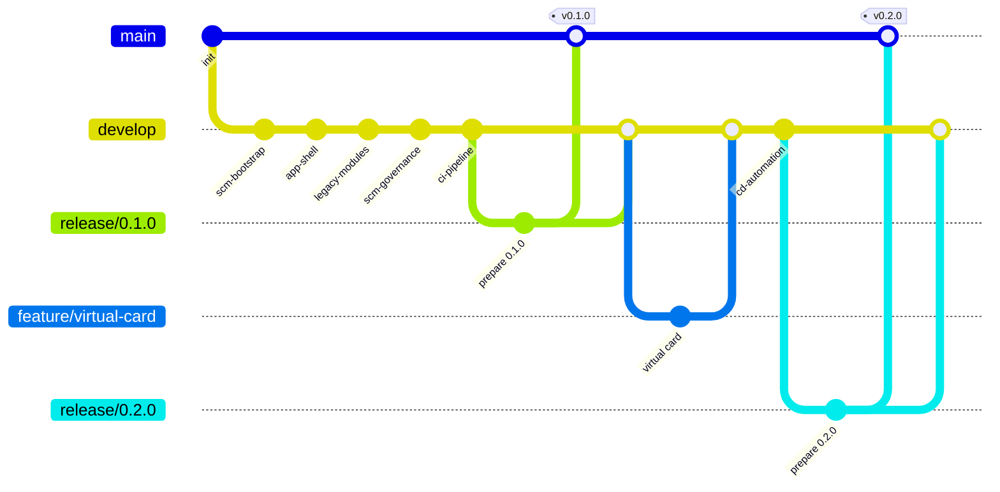
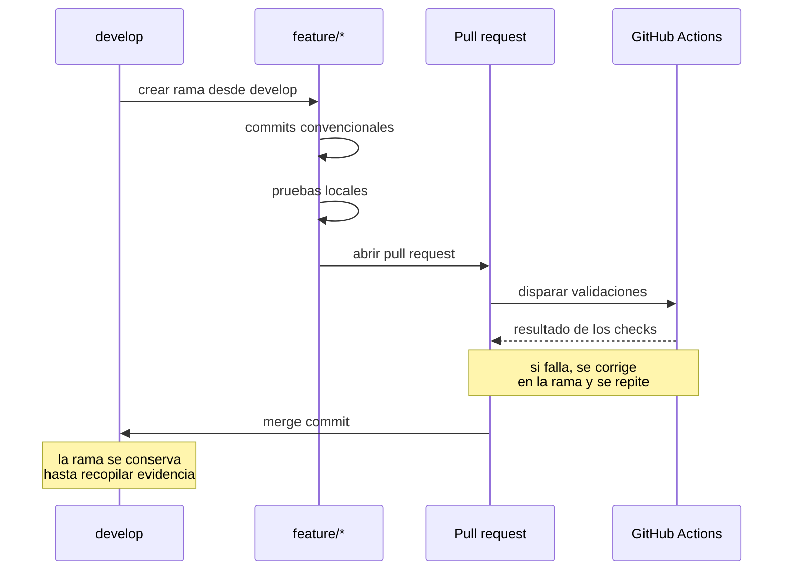

# Estrategia de ramas — GitFlow liviano

## Por qué GitFlow y no trunk-based development

El equipo se modela como una **consultora de software** que desarrolla y mantiene soluciones para
un cliente. Esa forma organizativa, y no una preferencia estética, es lo que determina la
estrategia de ramas.

En una consultora existen simultáneamente dos realidades: la versión que el cliente tiene
instalada y aprobada, y el trabajo de la siguiente entrega. Ambas pueden requerir atención el
mismo día. Si un defecto aparece en la versión entregada, la corrección debe partir exactamente de
lo que el cliente tiene, no del trabajo en curso.

GitFlow modela esa separación de forma explícita:

| Necesidad de la consultora                                         | Cómo la resuelve GitFlow                                            |
| ------------------------------------------------------------------ | ------------------------------------------------------------------- |
| Saber qué versión está formalmente entregada                       | `main` contiene únicamente versiones liberadas, cada una con su tag |
| Integrar el trabajo de la siguiente entrega                        | `develop` acumula la integración continua                           |
| Aislar cada solicitud del cliente                                  | Una rama `feature/*` por issue o RFC                                |
| Estabilizar y aprobar una entrega antes de liberarla               | `release/*` permite validar sin bloquear el desarrollo              |
| Responder a un incidente en producción sin arrastrar trabajo nuevo | `hotfix/*` parte de `main`, no de `develop`                         |
| Auditar quién cambió qué y con qué autorización                    | Cada integración es un pull request con su evaluación de impacto    |
| Identificar entregables de forma inequívoca                        | Tags anotados sobre `main`                                          |

### El trade-off, declarado honestamente

**GitFlow no es universalmente superior a trunk-based development.** Tiene costos reales:

| Costo de GitFlow                                  | Consecuencia práctica                                                                |
| ------------------------------------------------- | ------------------------------------------------------------------------------------ |
| Más ramas y más operaciones de integración        | Cada cambio requiere rama, PR y merge; el ciclo es más lento que empujar a un tronco |
| Ramas de larga vida                               | Mayor probabilidad de conflictos al integrar                                         |
| Doble integración en cada release                 | Toda rama `release/*` debe volver a `develop` tras fusionarse en `main`              |
| Ceremonia desproporcionada para cambios triviales | Corregir una errata en el README requiere el mismo recorrido que una funcionalidad   |

Trunk-based development sería la mejor elección si el objetivo fuera maximizar la frecuencia de
despliegue con un equipo pequeño y despliegue continuo. **No es este caso.** Aquí el objetivo es
demostrar entregas formales, baselines identificables, control de cambios auditable y separación
entre trabajo en evolución y versiones liberadas. Para eso, la ceremonia adicional de GitFlow no
es un costo accidental: es exactamente lo que produce la evidencia que la actividad requiere.

La decisión está registrada en `docs/adr/0002-gitflow-strategy.md`.

## Estructura de ramas



### Ramas permanentes

| Rama      | Contenido                                             | Origen de las integraciones                   | Protección         |
| --------- | ----------------------------------------------------- | --------------------------------------------- | ------------------ |
| `main`    | Únicamente versiones formalmente liberadas al cliente | `release/*` y `hotfix/*`                      | Ruleset `21182905` |
| `develop` | Integración de la siguiente entrega                   | `feature/*`, `fix/*`, `release/*`, `hotfix/*` | Ruleset `21182906` |

Ninguna de las dos admite commits directos ni force-push, y ninguna puede eliminarse.

### Ramas temporales

| Prefijo     | Propósito                                      | Parte de  | Se integra en          | Ejemplo                |
| ----------- | ---------------------------------------------- | --------- | ---------------------- | ---------------------- |
| `feature/*` | Nueva funcionalidad o solicitud del cliente    | `develop` | `develop`              | `feature/virtual-card` |
| `fix/*`     | Corrección ordinaria, sin urgencia productiva  | `develop` | `develop`              | `fix/date-validation`  |
| `release/*` | Estabilización y aprobación de una entrega     | `develop` | `main` **y** `develop` | `release/0.1.0`        |
| `hotfix/*`  | Corrección urgente de un defecto en producción | `main`    | `main` **y** `develop` | `hotfix/0.1.1`         |

La diferencia entre `fix/*` y `hotfix/*` no es la gravedad del defecto sino **de dónde parte la
corrección**. Un `hotfix/*` nace de `main` porque debe aplicarse sobre lo que el cliente tiene
instalado, sin arrastrar el trabajo no liberado que hay en `develop`.

### Nomenclatura

Un único prefijo por propósito, sin sinónimos. `feature/`, nunca `feat/`. Esta consistencia es una
corrección deliberada respecto al repositorio de referencia analizado, donde ambos prefijos
coexistían y hacían imposible filtrar ramas por tipo de forma fiable.

```
<tipo>/<descripcion-en-kebab-case>
release/<major>.<minor>.<patch>
hotfix/<major>.<minor>.<patch>
```

Los identificadores de rama se escriben en inglés, igual que el código. La documentación y la
interfaz de la aplicación están en español.

## Ramas planificadas y su estado

| Rama                     | Issue / RFC | Propósito                                       | Estado      |
| ------------------------ | ----------- | ----------------------------------------------- | ----------- |
| `feature/scm-bootstrap`  | #1          | Scaffold, herramientas de calidad y CI mínimo   | Integrada   |
| `feature/app-shell`      | #1          | Shell responsive, navegación, estados y PWA     | Integrada   |
| `feature/legacy-modules` | #2, #9      | Ocho módulos del portal y deuda TD-001 a TD-009 | Integrada   |
| `feature/scm-governance` | #3          | Gobierno SCM, ADR y RFC-001                     | En curso    |
| `feature/ci-pipeline`    | #4          | CI completo, métricas y control de no regresión | Planificada |
| `release/0.1.0`          | #7          | Primera entrega                                 | Planificada |
| `feature/virtual-card`   | #5, RFC-001 | Carné virtual QR                                | Planificada |
| `feature/cd-automation`  | #6          | Despliegue, release por tag y GHCR              | Planificada |
| `release/0.2.0`          | #8          | Segunda entrega                                 | Planificada |

## Reglas de operación

**Obligatorias:**

- Todo cambio parte de una issue o de un RFC.
- Todo cambio se desarrolla en una rama, nunca en `main` ni en `develop`.
- Toda integración ocurre mediante pull request con checks de CI en verde.
- Toda integración usa **merge commit**.
- Las ramas se conservan hasta que la evidencia de la fase está recopilada.

**Prohibidas:**

- Squash merge y rebase merge, ambos deshabilitados a nivel de repositorio.
- Force-push sobre cualquier rama publicada.
- `git commit --amend` sobre commits ya publicados.
- Reescritura del historial de `main` o `develop`.
- Creación de un `hotfix/*` sin un defecto real en producción.

### Por qué merge commits y no squash

Squash merge produce un historial de lectura más cómoda, y por eso es la opción por defecto de
muchos equipos. Aquí se descarta deliberadamente porque **destruye exactamente la información que
la actividad debe evidenciar**: los commits individuales de cada rama, con su tipo convencional,
su alcance y su cuerpo. Un squash de la fase de módulos legacy convertiría cinco commits
convencionales trazables en uno solo, y la evidencia de la convención desaparecería con ellos.

El merge commit conserva ambas cosas: el detalle de cada commit y un punto de integración
identificable que declara cuándo un conjunto de cambios entró en la baseline.

## Ciclo de vida de una funcionalidad



## Ciclo de vida de una entrega

1. Crear `release/X.Y.Z` desde `develop`.
2. Actualizar la versión en `package.json` y el `CHANGELOG.md`.
3. Registrar la baseline de métricas correspondiente.
4. Ejecutar el conjunto completo de validaciones.
5. Crear el tag de candidata `vX.Y.Z-rc.1`.
6. Abrir pull request hacia `main` y esperar los checks.
7. Fusionar con merge commit.
8. Crear el tag anotado `vX.Y.Z` sobre `main`.
9. Publicar el GitHub Release con las notas del `CHANGELOG.md`.
10. **Reintegrar `release/X.Y.Z` en `develop`.**

El paso 10 es el que se olvida con más frecuencia y el que produce el fallo más difícil de
diagnosticar semanas después: si los ajustes hechos durante la estabilización no vuelven a
`develop`, la siguiente entrega los pierde silenciosamente y el defecto reaparece corregido en
`main` pero vivo en el desarrollo.
