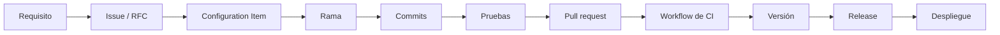

# Matriz de trazabilidad — AppConecta

La trazabilidad responde a una pregunta concreta: dado un requisito, ¿dónde está el código que lo
implementa, qué prueba lo verifica, quién autorizó el cambio y en qué versión se entregó? Y en
sentido inverso: dada una línea de código, ¿por qué existe?

Todos los identificadores de este documento son **reales y verificables**. Los campos que aún no
existen figuran como pendientes; ninguno se anticipa.

## Cadena de trazabilidad

## 1. Requisitos funcionales

| Requisito                                    | Issue | CI implementados                                  | Rama                     | Prueba que lo verifica                        | Versión |
| -------------------------------------------- | ----- | ------------------------------------------------- | ------------------------ | --------------------------------------------- | ------- |
| RF-01 Dashboard del colaborador              | #2    | CI-APP-PAGE-001, CI-APP-SVC-001                   | `feature/legacy-modules` | `src/pages/DashboardPage.test.tsx`            | v0.1.0  |
| RF-02 Perfil ficticio del colaborador        | #2    | CI-APP-PAGE-001                                   | `feature/legacy-modules` | Cubierto por `src/app/routes.test.tsx`        | v0.1.0  |
| RF-03 Noticias y anuncios corporativos       | #2    | CI-APP-PAGE-001, CI-APP-SVC-002                   | `feature/legacy-modules` | Cubierto por `src/app/routes.test.tsx`        | v0.1.0  |
| RF-04 Consulta de documentos laborales       | #2    | CI-APP-PAGE-001, CI-APP-SVC-001                   | `feature/legacy-modules` | `src/pages/DocumentsPage.test.tsx`            | v0.1.0  |
| RF-05 Consulta de desprendibles de nómina    | #2    | CI-APP-PAGE-001, CI-APP-SVC-001                   | `feature/legacy-modules` | `src/pages/PayrollPage.test.tsx`              | v0.1.0  |
| RF-06 Creación de solicitudes de RRHH        | #2    | CI-APP-PAGE-001, CI-APP-SVC-001, CI-APP-STORE-001 | `feature/legacy-modules` | `src/pages/RequestsPage.test.tsx`             | v0.1.0  |
| RF-07 Registro de incapacidades              | #2    | CI-APP-PAGE-001, CI-APP-SVC-001, CI-APP-STORE-001 | `feature/legacy-modules` | `src/pages/MedicalLeavesPage.test.tsx`        | v0.1.0  |
| RF-08 Consulta del estado de solicitudes     | #2    | CI-APP-PAGE-001, CI-APP-SVC-001                   | `feature/legacy-modules` | `src/pages/RequestStatusPage.test.tsx`        | v0.1.0  |
| RF-09 Navegación responsive                  | #1    | CI-APP-UI-002                                     | `feature/app-shell`      | `src/components/layout/AppShell.test.tsx`     | v0.1.0  |
| RF-10 Estados de carga                       | #1    | CI-APP-UI-003, CI-APP-HOOK-001                    | `feature/app-shell`      | `src/components/feedback/states.test.tsx`     | v0.1.0  |
| RF-11 Estados vacíos                         | #1    | CI-APP-UI-003                                     | `feature/app-shell`      | `src/components/feedback/states.test.tsx`     | v0.1.0  |
| RF-12 Manejo de errores                      | #1    | CI-APP-UI-003, CI-APP-HOOK-001                    | `feature/app-shell`      | `src/components/feedback/states.test.tsx`     | v0.1.0  |
| RF-13 Datos realistas pero ficticios         | #2    | CI-APP-SVC-002                                    | `feature/legacy-modules` | `src/services/legacyEmployeeService.test.ts`  | v0.1.0  |
| RF-14 Accesibilidad básica                   | #1    | CI-APP-UI-001, CI-APP-UI-002                      | `feature/app-shell`      | Aserciones de rol y etiqueta en toda la suite | v0.1.0  |
| RF-15 Experiencia coherente móvil/escritorio | #1    | CI-APP-UI-002                                     | `feature/app-shell`      | `src/components/layout/AppShell.test.tsx`     | v0.1.0  |
| RF-16 Carné virtual con QR                   | #5    | _pendiente_                                       | `feature/virtual-card`   | _pendiente_                                   | v0.2.0  |

Las funcionalidades RF-02 y RF-03 se verifican únicamente a través de las pruebas de enrutamiento.
Esa cobertura parcial no es un descuido sino la materialización deliberada de **TD-006**, y por
eso figura declarada aquí en lugar de presentarse como cobertura completa.

## 2. Requisitos de la Actividad 3

| Requisito de la actividad               | Implementación                                         | Evidencia verificable                            | Estado   |
| --------------------------------------- | ------------------------------------------------------ | ------------------------------------------------ | -------- |
| Crear repositorio Git                   | `llipiterdev/appconecta-scm`, público                  | URL del repositorio                              | Cumplido |
| Definir estrategia de branching         | GitFlow liviano                                        | `docs/git-workflow.md`, `ADR-0002`, ramas reales | Cumplido |
| Aplicar versionamiento semántico        | Política SemVer con tags anotados                      | `docs/versioning.md`                             | En curso |
| Buenas prácticas de commits             | Conventional Commits, verificados local y en CI        | `docs/conventional-commits.md`, historial        | Cumplido |
| Pipeline CI/CD con build, test y deploy | GitHub Actions, Pages y GHCR                           | `.github/workflows/`                             | En curso |
| Automatizar procesos clave              | Validación, métricas, release, despliegue y evidencias | Workflows y scripts                              | En curso |
| Documentar la implementación            | Conjunto documental de `docs/`                         | Este directorio                                  | En curso |
| Modelo de gestión de configuración      | CI, baselines, control de cambios y trazabilidad       | `docs/configuration-items.md` y siguientes       | Cumplido |

## 3. Trazabilidad de las integraciones realizadas

| Issue  | Rama                     | Commits (en orden)                                    | Pull request                                                 | Merge commit | Checks      | Versión |
| ------ | ------------------------ | ----------------------------------------------------- | ------------------------------------------------------------ | ------------ | ----------- | ------- |
| #1     | `feature/scm-bootstrap`  | `59b3f1a`, `0cb47f6`, `eb93ce1`, `33511c8`, `e0313d1` | [#10](https://github.com/llipiterdev/appconecta-scm/pull/10) | `7e62962`    | 4 en verde  | v0.1.0  |
| #1     | `feature/app-shell`      | `0d3b239`, `c1be172`, `11dec1c`, `8fc3b90`, `de5aef6` | [#11](https://github.com/llipiterdev/appconecta-scm/pull/11) | `c7d7609`    | 4 en verde  | v0.1.0  |
| #2, #9 | `feature/legacy-modules` | `8248fec`, `ab74b6a`, `53e2301`, `a4d6a28`, `ebb41c9` | [#12](https://github.com/llipiterdev/appconecta-scm/pull/12) | `207fcd3`    | 4 en verde  | v0.1.0  |
| #3     | `feature/scm-governance` | _en curso_                                            | _pendiente_                                                  | _pendiente_  | _pendiente_ | v0.1.0  |
| #4     | `feature/ci-pipeline`    | _pendiente_                                           | _pendiente_                                                  | _pendiente_  | _pendiente_ | v0.1.0  |
| #7     | `release/0.1.0`          | _pendiente_                                           | _pendiente_                                                  | _pendiente_  | _pendiente_ | v0.1.0  |
| #5     | `feature/virtual-card`   | _pendiente_                                           | _pendiente_                                                  | _pendiente_  | _pendiente_ | v0.2.0  |
| #6     | `feature/cd-automation`  | _pendiente_                                           | _pendiente_                                                  | _pendiente_  | _pendiente_ | v0.2.0  |
| #8     | `release/0.2.0`          | _pendiente_                                           | _pendiente_                                                  | _pendiente_  | _pendiente_ | v0.2.0  |

Los cuatro checks obligatorios son: mensajes de commit, calidad estática, pruebas y build de
producción.

## 4. Trazabilidad del control de cambios

| Cambio                     | Tipo             | Autorización                | Issue / RFC | Rama                     | Estado      |
| -------------------------- | ---------------- | --------------------------- | ----------- | ------------------------ | ----------- |
| Scaffold y herramientas    | Cambio estándar  | Issue + PR + CI             | #1          | `feature/scm-bootstrap`  | Cerrado     |
| Shell responsive y PWA     | Cambio estándar  | Issue + PR + CI             | #1          | `feature/app-shell`      | Cerrado     |
| Módulos del portal y deuda | Cambio estándar  | Issue + PR + CI             | #2, #9      | `feature/legacy-modules` | Cerrado     |
| Gobierno SCM               | Cambio estándar  | Issue + PR + CI             | #3          | `feature/scm-governance` | En curso    |
| Pipeline CI completo       | Cambio estándar  | Issue + PR + CI             | #4          | `feature/ci-pipeline`    | Planificado |
| Carné virtual QR           | **Cambio mayor** | **RFC-001 + CCB + PR + CI** | #5, RFC-001 | `feature/virtual-card`   | Aprobado    |
| Pipeline CD                | Cambio estándar  | Issue + PR + CI             | #6          | `feature/cd-automation`  | Planificado |
| Rulesets de protección     | Administrativo   | Registro documentado        | —           | No aplica                | Cerrado     |

## 5. Trazabilidad de la deuda técnica

| Deuda  | Introducida en           | Commit principal | CI afectado          | Registro                          | Intervención |
| ------ | ------------------------ | ---------------- | -------------------- | --------------------------------- | ------------ |
| TD-001 | `feature/legacy-modules` | `ab74b6a`        | CI-APP-SVC-001       | `docs/technical-debt-register.md` | Actividad 4  |
| TD-002 | `feature/legacy-modules` | `ab74b6a`        | CI-APP-STORE-001     | `docs/technical-debt-register.md` | Actividad 4  |
| TD-003 | `feature/legacy-modules` | `ab74b6a`        | CI-APP-SVC-001       | `docs/technical-debt-register.md` | Actividad 4  |
| TD-004 | `feature/legacy-modules` | `ab74b6a`        | CI-APP-SVC-001       | `docs/technical-debt-register.md` | Actividad 4  |
| TD-005 | `feature/legacy-modules` | `ab74b6a`        | CI-APP-SVC-001       | `docs/technical-debt-register.md` | Actividad 4  |
| TD-006 | `feature/legacy-modules` | `a4d6a28`        | CI-TST-COMP-001      | `docs/technical-debt-register.md` | Actividad 4  |
| TD-007 | `feature/legacy-modules` | `ab74b6a`        | CI-CFG-DEP-001       | `docs/technical-debt-register.md` | Posterior    |
| TD-008 | `feature/legacy-modules` | `8248fec`        | CI-APP-SVC-002       | `docs/technical-debt-register.md` | Actividad 4  |
| TD-009 | `feature/legacy-modules` | `ab74b6a`        | Estructura de `src/` | `docs/technical-debt-register.md` | Actividad 4  |

Las nueve deudas se introdujeron en la misma rama y quedaron registradas con métrica medida en el
mismo pull request que las introdujo. Ese es el punto: la deuda se documenta en el momento en que
se contrae, no cuando alguien la descubre después.

## 6. Trazabilidad de baselines

| Baseline      | Identificador Git | Contenido                      | Documento           | Estado             |
| ------------- | ----------------- | ------------------------------ | ------------------- | ------------------ |
| `BL-FUNC-001` | `114e7b2`         | Alcance y requisitos aprobados | `docs/baselines.md` | Establecida        |
| `BL-DES-001`  | _pendiente_       | Arquitectura y decisiones      | `docs/baselines.md` | En establecimiento |
| `BL-DEV-001`  | `v0.1.0-rc.1`     | Código candidato a v0.1.0      | `docs/baselines.md` | Pendiente          |
| `BL-PROD-001` | `v0.1.0`          | Primera entrega                | `docs/baselines.md` | Pendiente          |
| `BL-DEV-002`  | `v0.2.0-rc.1`     | Código candidato a v0.2.0      | `docs/baselines.md` | Pendiente          |
| `BL-PROD-002` | `v0.2.0`          | Segunda entrega                | `docs/baselines.md` | Pendiente          |

## 7. Cobertura de la trazabilidad

| Dimensión                                        | Cobertura actual |
| ------------------------------------------------ | ---------------- |
| Requisitos funcionales con issue asociada        | 16 de 16         |
| Requisitos funcionales implementados             | 15 de 16         |
| Requisitos implementados con prueba automatizada | 15 de 15         |
| Cambios integrados mediante pull request         | 3 de 3           |
| Cambios integrados con checks en verde           | 3 de 3           |
| Deudas registradas con métrica medida            | 9 de 9           |
| Configuration Items con propietario asignado     | 66 de 66         |

## Mantenimiento de esta matriz

La matriz se actualiza en el mismo pull request que produce el cambio, nunca al final del
proyecto. Una trazabilidad reconstruida a posteriori es un ejercicio de memoria, no un registro:
sirve para el informe, pero no para responder a la pregunta que la trazabilidad existe para
responder.
