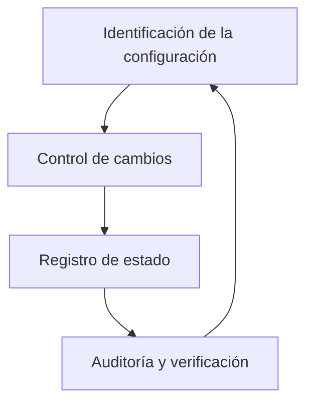
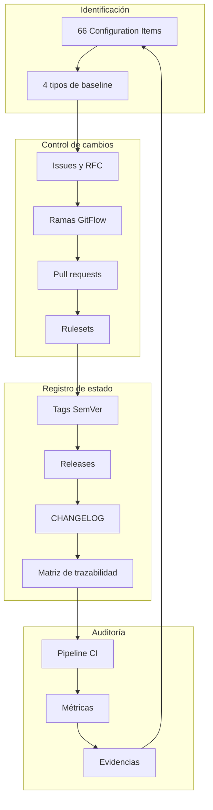

# Unidad 2 — Estrategia de Gestión de Configuración de Software

> **Propósito de este documento.** La Actividad 2 definió la estrategia SCM de AppConecta en el
> plano conceptual. Este documento recoge esa estrategia y, sobre todo, señala **dónde está
> implementada** en el repositorio. Una estrategia SCM que solo existe en un documento no es una
> estrategia: es una intención.

## 1. Objetivo de la gestión de configuración

Garantizar que en cualquier momento se pueda responder con precisión a cuatro preguntas:

1. ¿Qué elementos componen el sistema y quién responde por cada uno?
2. ¿Cuál es el estado aprobado y cómo se identifica de forma inequívoca?
3. ¿Qué cambió respecto a ese estado, por qué y con qué autorización?
4. ¿Cómo se recupera un estado anterior si algo sale mal?

Cada pregunta tiene su mecanismo, y cada mecanismo su artefacto verificable en el repositorio.

## 2. Los cuatro procesos y su implementación



| Proceso                | Qué resuelve                               | Implementación en este repositorio                                                  |
| ---------------------- | ------------------------------------------ | ----------------------------------------------------------------------------------- |
| **Identificación**     | Qué se controla y quién responde           | `docs/configuration-items.md` — 66 CI con diez atributos cada uno                   |
| **Control de cambios** | Cómo se autoriza una modificación          | `docs/change-control.md`, rulesets, plantillas de issue y PR, RFC                   |
| **Registro de estado** | En qué estado está cada elemento           | `docs/baselines.md`, `docs/traceability-matrix.md`, `CHANGELOG.md`, tags y releases |
| **Auditoría**          | Cómo se verifica que lo anterior se cumple | Pipeline de CI, métricas reproducibles, `docs/evidencias/`                          |

## 3. Identificación de la configuración

### Criterio de inclusión

Un elemento es Configuration Item si cumple al menos una condición:

- Su modificación afecta al comportamiento o a la entrega del sistema.
- Es necesario para reproducir un build de forma idéntica.
- Constituye evidencia del proceso de gestión de configuración.
- Es un artefacto entregable al cliente.

El segundo criterio es el que hace que `package-lock.json` sea un CI **crítico** y no un archivo
generado sin importancia. Sin él, dos builds de la misma versión pueden diferir, y una comparación
de métricas entre la Actividad 3 y la Actividad 4 no distinguiría el efecto de la refactorización
del efecto de una actualización de dependencias ocurrida entre medias.

### Categorías y volumen

| Categoría             | CI implementados | Ejemplo           |
| --------------------- | ---------------- | ----------------- |
| Aplicación            | 11               | `CI-APP-SVC-001`  |
| Configuración técnica | 12               | `CI-CFG-LOCK-001` |
| Pruebas               | 4                | `CI-TST-UNIT-001` |
| Automatización CI/CD  | 6                | `CI-PIPE-CI-001`  |
| Documentación         | 17               | `CI-DOC-CI-001`   |
| Entrega               | 0 (6 pendientes) | `CI-REL-TAG-001`  |
| **Conceptuales**      | **0 de 11**      | `CI-EXT-PAY-001`  |

La última fila es una decisión de honestidad del inventario. Los once CI conceptuales aparecen
porque el modelo SCM debe reconocer las dependencias externas del sistema, y figuran
explícitamente como **no implementados**. Presentar un adaptador simulado como una integración
implementada invalidaría el inventario completo.

## 4. Baselines

| Baseline   | Contenido                      | Identificación                | Momento de establecimiento         |
| ---------- | ------------------------------ | ----------------------------- | ---------------------------------- |
| Funcional  | Requisitos y alcance aprobados | Commit `114e7b2`              | Al definir el alcance del proyecto |
| Diseño     | Arquitectura y decisiones      | Commit de la fase de gobierno | Al aprobar la arquitectura         |
| Desarrollo | Código candidato               | Tags `vX.Y.Z-rc.N`            | Antes de aprobar una entrega       |
| Productiva | Versión liberada               | Tags `vX.Y.Z`                 | Al fusionar en `main`              |

Las dos primeras se identifican por commit y las dos últimas por tag anotado. La diferencia no es
arbitraria: un tag existe cuando aporta un punto de recuperación o representa un entregable, no
para decorar el historial.

El detalle completo vive en `docs/baselines.md`.

## 5. Control de cambios

El proceso definido en la Actividad 2 —RFC, evaluación de impacto, aprobación, implementación,
verificación, actualización y cierre— está implementado con mecanismos que **la plataforma hace
cumplir**, no con reglas que dependan de la disciplina de quien contribuye:

| Etapa del proceso       | Mecanismo que la implementa                        | ¿Se puede omitir?                              |
| ----------------------- | -------------------------------------------------- | ---------------------------------------------- |
| Solicitud               | Issue con plantilla, o RFC en `docs/rfc/`          | Sí, pero queda sin trazabilidad y se detecta   |
| Evaluación de impacto   | Secciones obligatorias de la plantilla de PR       | Sí, pero el PR queda visiblemente incompleto   |
| Aprobación              | Ruleset con pull request obligatorio               | **No.** La plataforma rechaza el push directo  |
| Implementación          | Rama con commits validados por commitlint          | **No.** El hook y el job de CI lo impiden      |
| Verificación            | Status checks obligatorios                         | **No.** Un PR en rojo no puede fusionarse      |
| Actualización de estado | Merge commit, tag, release, matriz de trazabilidad | Parcialmente; el merge commit es automático    |
| Cierre                  | Issue cerrada con referencia al PR                 | Sí, pero se detecta al revisar la trazabilidad |

Las tres etapas que **no pueden omitirse** son las que garantizan que ningún cambio llegue a una
baseline sin autorización y sin validación. El resto son convenciones cuya omisión, aunque
posible, deja rastro visible.

## 6. Trazabilidad

La cadena implementada:

```
Requisito → Issue/RFC → Configuration Item → Rama → Commits → Pruebas →
Pull request → Workflow → Versión → Release → Despliegue
```

Los mecanismos que la sostienen:

| Enlace                  | Mecanismo                                             |
| ----------------------- | ----------------------------------------------------- |
| Requisito → Issue       | Plantillas de issue con campo de requisito            |
| Issue → Rama            | Nomenclatura de ramas y referencia en la issue        |
| Issue → Commits         | `Refs #n` y `Closes #n` en el pie del mensaje         |
| Commits → Pull request  | Merge commit con el número de PR entre paréntesis     |
| Pull request → Workflow | Checks asociados al commit del PR                     |
| Versión → Release       | Tag anotado y GitHub Release generado desde él        |
| Todo → Matriz           | `docs/traceability-matrix.md`, actualizada en cada PR |

La matriz se actualiza **en el mismo pull request que produce el cambio**. Reconstruirla al final
del proyecto produciría un documento que sirve para el informe pero no para responder a la
pregunta que la trazabilidad existe para responder.

## 7. Roles y responsabilidades

Los siete roles definidos en la Actividad 2 —representante del cliente, líder de consultoría,
desarrollo, revisión, responsable SCM, responsable DevOps y comité de control de cambios— están
detallados con su matriz RACI en `docs/raci.md`.

La declaración pertinente aquí es la misma que allí: la ejecución técnica en GitHub se centralizó
mediante una única identidad, y no se han fabricado revisores ni aprobaciones humanas. La
separación de control realmente existente es la que proporcionan las validaciones automáticas, que
no pueden ser complacidas por quien escribe el código.

## 8. Herramientas

| Función                       | Herramienta                        | CI asociado          |
| ----------------------------- | ---------------------------------- | -------------------- |
| Control de versiones          | Git                                | —                    |
| Repositorio y plataforma      | GitHub                             | —                    |
| Control de cambios            | Issues, PR, rulesets               | `CI-PIPE-RULE-001`   |
| Convención de commits         | commitlint y Husky                 | `CI-CFG-COMMIT-001`  |
| Integración continua          | GitHub Actions                     | `CI-PIPE-CI-001`     |
| Identificación de versiones   | Tags anotados                      | `CI-REL-TAG-001`     |
| Registro de cambios           | `CHANGELOG.md`                     | `CI-REL-CHG-001`     |
| Métricas                      | ESLint, jscpd, Vitest, `npm audit` | `CI-PIPE-METRIC-001` |
| Actualización de dependencias | Dependabot                         | `CI-PIPE-DEP-001`    |

## 9. Auditoría de la configuración

La auditoría verifica dos cosas distintas que conviene no confundir:

**Auditoría funcional** — ¿el sistema hace lo que la baseline dice que hace? Se verifica mediante
las pruebas automatizadas y, a partir de la fase de CI completo, mediante pruebas end-to-end de los
flujos críticos.

**Auditoría física** — ¿los artefactos de la baseline son los que dicen ser? Se verifica mediante
la correspondencia entre tag, `package.json`, artefacto de build e imagen de contenedor, validada
automáticamente por el workflow de release.

La segunda es la que suele omitirse, y es la que detecta el error más silencioso: una imagen
etiquetada como `0.1.0` que internamente reporta otra versión. Nada en la operación normal lo
evidencia.

## 10. Modelo SCM integral



El ciclo se cierra: las evidencias de la auditoría alimentan la identificación de la siguiente
iteración. Un modelo SCM que no se realimenta describe un momento, no un proceso.
