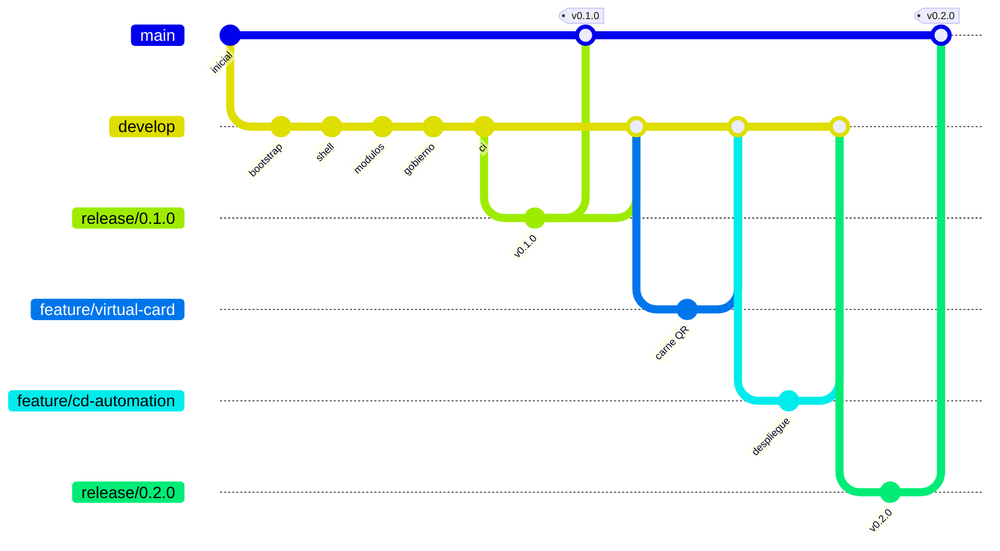
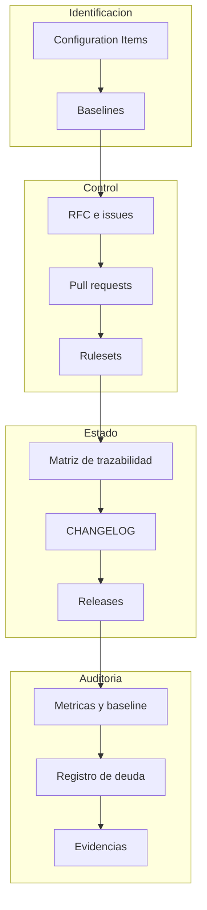

# Actividad 3 — Estrategia de control de versiones y automatización DevOps

**Asignatura:** Gestión de Configuración y Mantenimiento de Software
**Sistema:** AppConecta — Portal del colaborador
**Repositorio:** <https://github.com/llipiterdev/appconecta-scm>
**Versiones entregadas:** v0.1.0 y v0.2.0
**Fecha:** 22 de agosto de 2026

## Integrantes

| Integrante                      | Rol organizacional principal            | Cuenta de GitHub |
| ------------------------------- | --------------------------------------- | ---------------- |
| Miguel Santiago Acevedo Virgues | Representante del cliente / RRHH        | `GeronimoAv`     |
| Julian Camilo Corredor Rojas    | Responsable de gestión de configuración | `Jcorredor94`    |
| Brayan Estif Calderon Gomez     | Responsable DevOps                      | `llipiterdev`    |

La distribución de roles y la matriz RACI están en [`docs/raci.md`](../raci.md). Conviene declararlo
aquí sin rodeos: **la ejecución técnica en GitHub se centralizó en una sola identidad** para
garantizar automatización y reproducibilidad. Los commits de las fases finales registran la
coautoría mediante el mecanismo `Co-authored-by` de Git. No se registran aprobaciones ni revisiones
humanas que no ocurrieran.

---

## 1. Introducción

Esta actividad responde al reto: _cómo implementar una estrategia de control de versiones y
automatización que permita gestionar eficientemente la evolución del software_.

La respuesta que se defiende aquí es que una estrategia de control de versiones no se demuestra
describiéndola, sino ejecutándola sobre un sistema real hasta que produzca artefactos verificables:
ramas, pull requests, checks, tags, releases, imágenes y despliegues que existan y puedan
inspeccionarse. Todo lo que este documento afirma es comprobable en el repositorio.

## 2. Contexto

AppConecta es una aplicación móvil corporativa para centralizar procesos de Recursos Humanos y
comunicación interna. Las actividades previas de la asignatura la caracterizaron como sistema:

- **Actividad 1** analizó su evolución, su envejecimiento, sus categorías de deuda técnica y los
  tipos de mantenimiento aplicables. Resumen en
  [`docs/unidad-1/analisis-evolucion.md`](../unidad-1/analisis-evolucion.md).
- **Actividad 2** definió el modelo de gestión de configuración: Configuration Items, baselines,
  control de cambios, trazabilidad y roles. Resumen en
  [`docs/unidad-2/estrategia-scm.md`](../unidad-2/estrategia-scm.md).

La **Actividad 4** exigirá una intervención de mantenimiento con métricas antes y después. Esa
exigencia determina una decisión central de esta entrega, que se explica en el apartado 21: la
Actividad 3 debe terminar con deuda técnica **medible y pendiente**.

## 3. Alcance de la simulación

AppConecta, tal como existe en este repositorio, es una **simulación académica funcional**. Es
importante ser explícito sobre qué es real y qué no, porque la credibilidad de toda la evidencia
depende de esa distinción.

| Aspecto                                              | Naturaleza                          |
| ---------------------------------------------------- | ----------------------------------- |
| Aplicación web, código, pruebas y pipelines          | **Reales y ejecutables**            |
| Repositorio, ramas, commits, PR, tags, releases      | **Reales y verificables**           |
| Métricas de cobertura, complejidad y duplicación     | **Medidas, no estimadas**           |
| APIs de nómina y Recursos Humanos                    | Simuladas mediante adaptadores mock |
| Autenticación corporativa, base de datos, cloud      | Conceptuales, no implementadas      |
| Aplicaciones nativas Android e iOS                   | Conceptuales, fuera de alcance      |
| Datos del colaborador                                | Ficticios en su totalidad           |
| Diez años de operación descritos en la Actividad 1   | **Supuesto académico**              |
| Decisión del Comité de Control de Cambios en RFC-001 | **Simulada**, así declarada         |

No se afirma que hayan ocurrido incidentes reales, ni existen diez años de commits, ni se han
retrocedido fechas de Git. El commit inicial es del 21 de agosto de 2026 y así consta.

## 4. Repositorio

| Atributo                           | Valor                                           |
| ---------------------------------- | ----------------------------------------------- |
| URL                                | <https://github.com/llipiterdev/appconecta-scm> |
| Visibilidad                        | Pública                                         |
| Licencia                           | MIT                                             |
| Rama principal                     | `main`                                          |
| Rama de integración                | `develop`                                       |
| Método de integración              | Merge commit (squash y rebase deshabilitados)   |
| Idioma de interfaz y documentación | Español                                         |
| Idioma del código                  | Inglés                                          |

**Stack:** React 19, TypeScript, Vite, Tailwind CSS, React Router, Vitest, Testing Library,
Playwright, ESLint, Prettier, commitlint, Husky, Docker y GitHub Actions, sobre Node 24.

## 5. Justificación de GitFlow liviano

El equipo se modela como una consultora que desarrolla y mantiene soluciones para clientes. Esa
premisa, y no una preferencia estética, es la que determina la estrategia.

| Necesidad de la consultora                             | Elemento de GitFlow que la cubre |
| ------------------------------------------------------ | -------------------------------- |
| Distinguir lo entregado de lo que está en construcción | `main` frente a `develop`        |
| Aislar cada solicitud del cliente                      | `feature/*`                      |
| Estabilizar y aprobar una entrega antes de liberarla   | `release/*`                      |
| Responder a un incidente en producción                 | `hotfix/*`                       |
| Identificar entregables de forma inequívoca            | Tags anotados                    |
| Documentar la autorización de cada cambio              | Pull requests                    |

**El trade-off, dicho sin adornos.** GitFlow introduce más ramas y más operaciones que
trunk-based development. En un equipo con despliegue continuo varias veces al día, esa ceremonia
sería un lastre. Aquí resulta adecuada porque el proyecto tiene entregas formales, baselines que
deben permanecer estables, auditoría y separación entre lo liberado y lo que evoluciona.

**GitFlow no es universalmente superior.** Es apropiado para este contexto. La justificación
completa, con las alternativas descartadas, está en
[`docs/adr/0002-gitflow-strategy.md`](../adr/0002-gitflow-strategy.md).

## 6. Convenciones de ramas

| Prefijo     | Parte de  | Se integra en          |
| ----------- | --------- | ---------------------- |
| `feature/*` | `develop` | `develop`              |
| `fix/*`     | `develop` | `develop`              |
| `chore/*`   | `develop` | `develop`              |
| `release/*` | `develop` | `main` **y** `develop` |
| `hotfix/*`  | `main`    | `main` **y** `develop` |

El prefijo `chore/*` **no estaba previsto** y se incorporó al cerrar la primera entrega, cuando
apareció trabajo que ninguno de los otros describía: registrar la baseline establecida y completar
la trazabilidad. La ampliación se documentó en lugar de forzar el trabajo dentro de `feature/*`.

Se creó **un** `hotfix/*`, y no fue inventado. Al publicar v0.2.0, el workflow de publicación falló
porque ejecutaba el control de no regresión sin haber generado antes las mediciones que compara: el
tag y el release quedaron creados, pero sin artefactos ni imagen. El defecto estaba en código ya
integrado en `main`, que es precisamente la situación que `hotfix/*` existe para atender.

No se simuló ningún incidente adicional para poder ejercitar la rama. Si el defecto no hubiera
aparecido, la tabla no tendría esta fila.

## 7. Conventional Commits

Los diez tipos permitidos son `feat`, `fix`, `docs`, `test`, `refactor`, `ci`, `build`, `chore`,
`perf` y `style`. La validación ocurre en dos puntos independientes: el hook `commit-msg` de Husky
en local, y el job de CI en cada pull request. El segundo existe porque el primero puede saltarse
con `--no-verify`: una validación que solo vive en la máquina del desarrollador es una
recomendación, no un control.

**Dos excepciones documentadas**, ambas en
[`docs/conventional-commits.md`](../conventional-commits.md):

1. El commit inicial `114e7b2` precede a la adopción de la convención. Se conserva sin reescribir.
2. De los commits de merge se valida la cabecera y no el cuerpo, porque este último lo compone la
   plataforma al integrar y corregirlo después exigiría reescribir historia publicada.

## 8. Versionamiento semántico

| Cambio                  | Efecto  |
| ----------------------- | ------- |
| `fix` compatible        | PATCH   |
| `feat` compatible       | MINOR   |
| `BREAKING CHANGE`       | MAJOR   |
| Solo documentación o CI | Ninguno |

| Versión | Contenido                                                       | Tipo  |
| ------- | --------------------------------------------------------------- | ----- |
| v0.1.0  | Portal con ocho módulos, gobierno SCM y pipeline de integración | MINOR |
| v0.2.0  | Carné virtual QR y pipelines de despliegue y publicación        | MINOR |

**No se publica v1.0.0.** La simulación aún no expone una interfaz estable frente a un cliente: el
servicio legacy será reestructurado en la Actividad 4, y presentar como estable algo que se va a
modificar sería una declaración falsa. La política completa está en
[`docs/versioning.md`](../versioning.md).

Ambos tags son **anotados** y su coincidencia con `package.json` se verifica automáticamente antes
de publicar.

## 9. Baselines

| Baseline      | Identificador | Contenido                 | Estado      |
| ------------- | ------------- | ------------------------- | ----------- |
| `BL-FUNC-001` | `114e7b2`     | Alcance y requisitos      | Establecida |
| `BL-DES-001`  | `a2b8394`     | Arquitectura y decisiones | Establecida |
| `BL-DEV-001`  | `v0.1.0-rc.1` | Código candidato a v0.1.0 | Establecida |
| `BL-PROD-001` | `v0.1.0`      | Primera entrega           | Establecida |
| `BL-DEV-002`  | `v0.2.0-rc.1` | Código candidato a v0.2.0 | Establecida |
| `BL-PROD-002` | `v0.2.0`      | Segunda entrega           | Establecida |

Una baseline productiva solo se declara establecida cuando **todos** sus artefactos existen: el tag
anotado, el release, el artefacto con su suma de verificación, la imagen publicada y el despliegue
verificado.

`BL-PROD-002` es la primera que reúne los seis, y su establecimiento no fue inmediato. La primera
ejecución del workflow de publicación falló y el release quedó creado sin artefactos, de modo que la
baseline permaneció declarada como **incompleta** durante ese intervalo. Se completó tras el hotfix
del PR [#27](https://github.com/llipiterdev/appconecta-scm/pull/27), repitiendo la publicación sobre
el mismo tag **sin moverlo**. El detalle está en [`docs/baselines.md`](../baselines.md).

## 10. Integración continua

Siete jobs en paralelo, sobre runners alojados por GitHub, sin secretos externos y con permisos
mínimos.

| Job                               | Verifica                                                  |
| --------------------------------- | --------------------------------------------------------- |
| Mensajes de commit                | Conventional Commits en todo el rango del pull request    |
| Calidad estática                  | Prettier, ESLint y tipos de TypeScript                    |
| Pruebas unitarias y de componente | 72 pruebas con cobertura                                  |
| Build de producción               | Compilación y tamaño del artefacto                        |
| End-to-end                        | 22 pruebas en móvil y escritorio contra el build real     |
| Métricas y no regresión           | Auditoría, complejidad, duplicación y control de baseline |
| Imagen de contenedor              | Construcción y verificación de que la imagen sirve la app |

Los siete son **obligatorios** en los rulesets de `main` y `develop`. El diseño completo está en
[`docs/ci-cd.md`](../ci-cd.md).

## 11. Despliegue continuo

| Workflow            | Disparador      | Produce                                           |
| ------------------- | --------------- | ------------------------------------------------- |
| Despliegue en Pages | `push` a `main` | Aplicación desplegada, verificada por smoke test  |
| Publicación         | Tag `v*.*.*`    | Artefacto con SHA-256 e imagen etiquetada en GHCR |

**URL desplegada y verificada:** <https://llipiterdev.github.io/appconecta-scm/>

El smoke test exige código 200 **y** contenido de AppConecta en la respuesta, con reintentos. Un 200
a secas lo devolvería también una página de error de la plataforma.

Artefactos producidos y comprobados en la entrega v0.2.0:

| Artefacto            | Identificación                                                             |
| -------------------- | -------------------------------------------------------------------------- |
| Paquete del build    | `appconecta-v0.2.0-dist.tar.gz`, 612 637 bytes                             |
| Suma de verificación | `appconecta-v0.2.0-dist.tar.gz.sha256`                                     |
| Imagen               | `ghcr.io/llipiterdev/appconecta-scm:0.2.0`, también `0.2` y `sha-0595748…` |
| Digest               | `sha256:c7dd553c6476ce48f7c09d97bd1ed3399373e2202912a6f7fe6d08b7fa449615`  |

## 12. Automatizaciones implementadas

| Automatización                       | Mecanismo                       |
| ------------------------------------ | ------------------------------- |
| Validación de mensajes de commit     | commitlint, en local y en CI    |
| Formato y análisis previos al commit | Husky con lint-staged           |
| Validación completa por pull request | GitHub Actions                  |
| Bloqueo de integración sin checks    | Rulesets de repositorio         |
| Control de no regresión de métricas  | Script propio contra baseline   |
| Recopilación de evidencias           | Script propio                   |
| Despliegue                           | GitHub Actions y Pages          |
| Publicación de artefactos e imagen   | GitHub Actions, releases y GHCR |
| Actualización de dependencias        | Dependabot                      |

## 13. Configuration Items

El inventario completo está en [`docs/configuration-items.md`](../configuration-items.md) y
distingue tres estados que **no deben confundirse**:

| Estado           | Significado                                   |
| ---------------- | --------------------------------------------- |
| **Implementado** | Existe en el repositorio y es verificable     |
| **Simulado**     | Existe un adaptador mock que representa el CI |
| **Conceptual**   | Definido en el modelo, no implementado        |

Las APIs de nómina y RRHH, la autenticación corporativa, la base de datos, la infraestructura cloud
y las aplicaciones nativas son **conceptuales o simuladas**. En ningún punto de la documentación se
presentan como implementadas.

## 14. Control de cambios

```mermaid
graph LR
    A["RFC o issue"] --> B["Evaluacion de impacto"]
    B --> C["Aprobacion"]
    C --> D["Rama de trabajo"]
    D --> E["Commits convencionales"]
    E --> F["Pull request"]
    F --> G["Siete checks de CI"]
    G --> H["Merge commit"]
    H --> I["Version y baseline"]
    I --> J["Despliegue"]
    J --> K["Cierre del issue"]
```

El ciclo completo se ejercitó con **RFC-001**, el carné virtual: solicitud, evaluación de impacto
sobre nueve Configuration Items, aprobación condicionada por el Comité, implementación,
verificación automática de las condiciones y liberación en v0.2.0.

La condición más relevante que impuso el Comité fue que el cambio no agravara TD-001 ni TD-005. Se
cumplió por construcción, implementando el carné en un módulo independiente, y el control de no
regresión la verificó en cada pull request con tolerancia cero.

**No se simuló ningún cambio de emergencia.** El único `hotfix/*` del proyecto respondió a un
defecto real del pipeline, detectado por el propio pipeline, y se tramitó por el mismo camino que
cualquier otro cambio: rama, commits, pull request, siete checks y merge commit. Una emergencia no
justifica saltarse el control; justifica atravesarlo más rápido.

## 15. Trazabilidad

La matriz completa está en [`docs/traceability-matrix.md`](../traceability-matrix.md) y encadena
requisito, issue o RFC, Configuration Item, rama, commits, pruebas, pull request, checks, merge
commit, versión y release. Todos los identificadores existen; ninguno se anticipó.

## 16. Evidencias

Recopiladas por `npm run evidence`, que ejecuta las validaciones reales y falla si alguna falla. El
índice está en [`docs/evidencias/EVIDENCIAS.md`](../evidencias/EVIDENCIAS.md).

## 17. Riesgos

| Riesgo                                                     | Estado                                                  |
| ---------------------------------------------------------- | ------------------------------------------------------- |
| La deuda intencional se confunde con descuido              | Mitigado: nueve deudas registradas con métrica y motivo |
| La deuda crece sin que nadie lo note                       | Mitigado: control de no regresión con tolerancia cero   |
| Una dependencia introduce vulnerabilidades                 | Mitigado: auditoría en cada pull request, umbral cero   |
| La documentación describe algo distinto de lo implementado | Riesgo residual, mitigado por revisión en cada entrega  |
| Una sola identidad ejecuta y aprueba                       | **Aceptado y declarado**, no mitigado                   |

El último no se disfraza. La separación de control se implementó mediante pull request obligatorio
y validaciones automáticas; no se exigió una segunda aprobación humana porque el alcance académico y
la operación automatizada lo hacían inviable. Registrar revisores ficticios habría sido peor que
declarar la limitación.

## 18. Modelo SCM implementado

Las cuatro funciones clásicas de la gestión de configuración —identificación, control, registro de
estado y auditoría— tienen aquí un artefacto concreto y ejecutable, no solo una descripción.

## 19. Baseline de mantenimiento para la Actividad 4

Registrada en [`docs/maintenance-baseline.md`](../maintenance-baseline.md).

| Dimensión                         | Valor medido |
| --------------------------------- | ------------ |
| Complejidad ciclomática máxima    | 26           |
| Líneas del módulo legacy          | 580          |
| Duplicación                       | 0,71 %       |
| Cobertura de sentencias           | 90,02 %      |
| Cobertura de ramas                | 75,43 %      |
| Accesos directos a `localStorage` | 8            |
| Vulnerabilidades high/critical    | 0            |

Los indicadores del módulo legacy son **idénticos** a los de v0.1.0. El carné virtual y los
pipelines se añadieron sin que la deuda reservada creciera un punto, lo que es en sí mismo un
resultado: la deuda quedó **contenida**, no solo documentada.

**No se define ningún valor objetivo.** Un objetivo fijado antes de conocer el resultado real se
convierte, al escribir el informe, en una cifra que hay que justificar en lugar de en una medición
que hay que interpretar.

## 20. Deuda técnica entregada

Nueve deudas registradas en
[`docs/technical-debt-register.md`](../technical-debt-register.md), todas **abiertas**:

| Deuda  | Descripción resumida                                      | Intervención |
| ------ | --------------------------------------------------------- | ------------ |
| TD-001 | Servicio legacy multi-responsabilidad, 580 líneas         | Actividad 4  |
| TD-002 | Acoplamiento con `localStorage`, 8 accesos directos       | Actividad 4  |
| TD-003 | Validaciones duplicadas entre solicitudes e incapacidades | Actividad 4  |
| TD-004 | Mensajes y estados repetidos como literales               | Actividad 4  |
| TD-005 | Complejidad 26 en `processSubmission`                     | Actividad 4  |
| TD-006 | Cobertura limitada en módulos secundarios                 | Actividad 4  |
| TD-007 | Dependencia de `moment`, en modo mantenimiento            | Posterior    |
| TD-008 | Contratos mock consumidos sin adaptador                   | Actividad 4  |
| TD-009 | Separación de responsabilidades insuficiente              | Actividad 4  |

Ninguna deuda introduce vulnerabilidades, secretos, pérdida de datos ni pruebas deshabilitadas.

## 21. Por qué la deuda no se resolvió

Podría parecer una omisión y conviene explicar por qué es lo contrario.

La guía de la Sesión 5 exige demostrar una mejora mediante métricas antes y después. Una mejora sin
medición previa no se demuestra, solo se afirma. Si la Actividad 3 hubiera entregado un código sin
deuda, la Actividad 4 no tendría nada que medir y su informe sería una descripción de intenciones.

La deuda se introdujo, por tanto, de forma **deliberada, acotada, segura y medible**, y se dejó
protegida por un control automático que impide que crezca. El pipeline pasa **con** la deuda
presente porque está registrada, no porque se hayan bajado los umbrales.

## 22. Conclusiones

**Sobre el reto planteado.** Una estrategia de control de versiones gestiona la evolución del
software cuando cada cambio deja un rastro que permite responder, meses después, qué se cambió, por
qué, quién lo autorizó, qué se verificó y qué versión lo contiene. En este repositorio esa cadena
existe y es navegable.

**Sobre la automatización.** Su valor no está en ahorrar trabajo, sino en que un control automático
no se olvida. La condición que el Comité impuso a RFC-001 —no agravar la deuda reservada— no
dependió de que alguien la recordara al revisar: la verificó el pipeline en cada pull request.

**Sobre las baselines.** Su utilidad se hizo evidente en dos momentos concretos, ambos con la misma
forma. Al fallar la validación de mensajes en el primer pull request hacia `main`, la salida cómoda
era reescribir cinco commits con `push --force`. Al fallar la publicación de v0.2.0, la salida
cómoda era borrar el tag y volver a crearlo sobre el commit corregido.

Ambas se descartaron por la misma razón: habrían destruido exactamente la propiedad que las
baselines aportan, que un identificador siga apuntando mañana a lo mismo que hoy. En los dos casos
la alternativa costó más trabajo —adaptar la validación, añadir una entrada manual al workflow— y
en los dos casos ese trabajo es la evidencia de que la baseline significaba algo.

**Sobre la honestidad de la evidencia.** Este trabajo distingue en todo momento entre lo
configurado, lo ejecutado y lo verificado, y entre lo implementado, lo simulado y lo conceptual. Se
documentaron los fallos —el contenedor que no arrancaba, la duplicación introducida sin querer, la
validación de commits que falló al integrar— en lugar de presentar un recorrido sin tropiezos. Un
informe donde nada falla no describe un proyecto de software: describe un relato.

**Sobre lo que queda.** La deuda técnica está viva y medida, y la Actividad 4 tiene un punto de
partida contra el que comparar.

## 23. Referencias

### Documentación del proyecto

| Documento                                                            | Contenido                     |
| -------------------------------------------------------------------- | ----------------------------- |
| [`docs/architecture.md`](../architecture.md)                         | Arquitectura y capas          |
| [`docs/configuration-items.md`](../configuration-items.md)           | Inventario de CI              |
| [`docs/baselines.md`](../baselines.md)                               | Baselines y su identificación |
| [`docs/change-control.md`](../change-control.md)                     | Proceso de control de cambios |
| [`docs/git-workflow.md`](../git-workflow.md)                         | Estrategia de ramas           |
| [`docs/versioning.md`](../versioning.md)                             | Política de versionamiento    |
| [`docs/conventional-commits.md`](../conventional-commits.md)         | Convención de commits         |
| [`docs/ci-cd.md`](../ci-cd.md)                                       | Diseño de los pipelines       |
| [`docs/technical-debt-register.md`](../technical-debt-register.md)   | Registro de deuda             |
| [`docs/maintenance-baseline.md`](../maintenance-baseline.md)         | Baseline para la Actividad 4  |
| [`docs/traceability-matrix.md`](../traceability-matrix.md)           | Trazabilidad                  |
| [`docs/raci.md`](../raci.md)                                         | Roles y responsabilidades     |
| [`docs/rfc/RFC-001-virtual-card.md`](../rfc/RFC-001-virtual-card.md) | Solicitud formal de cambio    |
| [`docs/adr/`](../adr/)                                               | Decisiones de arquitectura    |

### Fuentes externas

- Chacon, S. y Straub, B. _Pro Git_, 2.ª edición. Apress.
- Driessen, V. «A successful Git branching model», 2010.
- Conventional Commits 1.0.0. <https://www.conventionalcommits.org/es/v1.0.0/>
- Semantic Versioning 2.0.0. <https://semver.org/lang/es/>
- Keep a Changelog 1.1.0. <https://keepachangelog.com/es-ES/1.1.0/>
- IEEE 828, _Standard for Configuration Management in Systems and Software Engineering_.
- Lehman, M. M. «Laws of Software Evolution Revisited», 1996.
- Material de la asignatura, sesiones 1 a 5.
