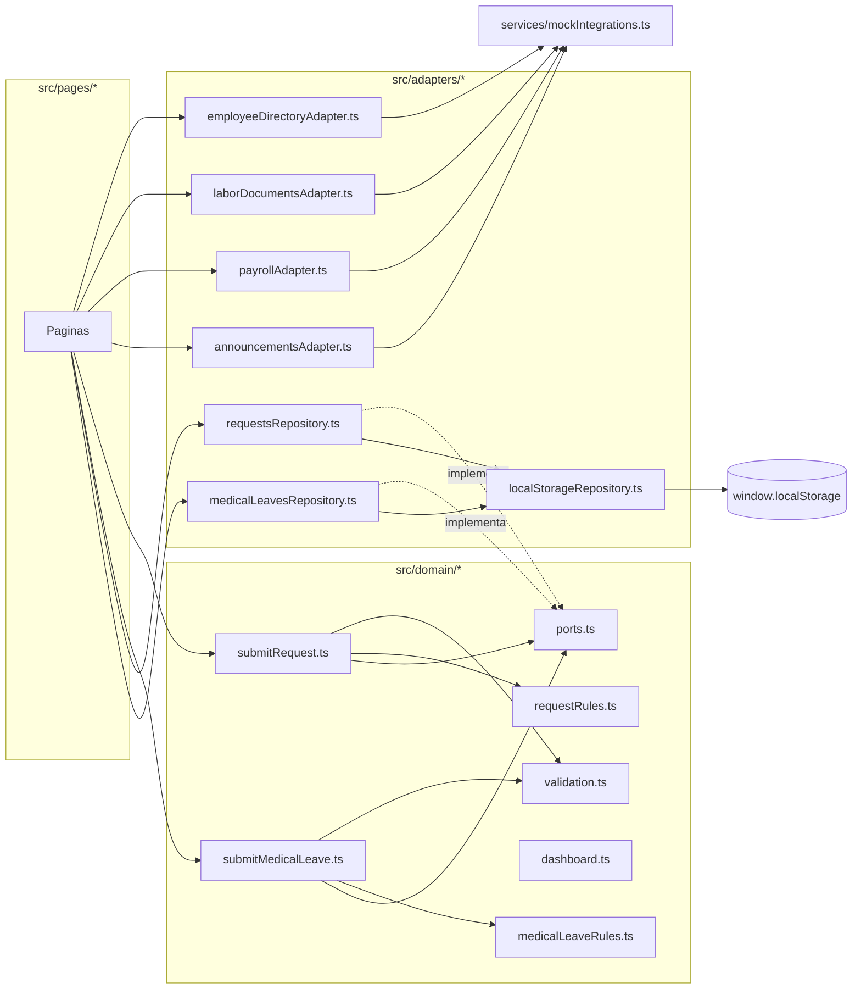

# Actividad 4 — Mantenimiento y evolución del software

**Asignatura:** Gestión de Configuración y Mantenimiento de Software
**Sistema:** AppConecta — Portal del colaborador
**Repositorio:** <https://github.com/llipiterdev/appconecta-scm>
**Intervención medida sobre:** rama `feature/legacy-service-refactor` (base v0.2.0)
**Fecha de medición:** 2026-08-27

## Integrantes

| Integrante                      | Rol organizacional principal            | Cuenta de GitHub |
| ------------------------------- | --------------------------------------- | ---------------- |
| Miguel Santiago Acevedo Virgues | Representante del cliente / RRHH        | `GeronimoAv`     |
| Julian Camilo Corredor Rojas    | Responsable de gestión de configuración | `Jcorredor94`    |
| Brayan Estif Calderon Gomez     | Responsable DevOps                      | pendiente        |

---

## 1. Reto

> ¿Cómo mejorar la calidad y sostenibilidad de un sistema de software mediante estrategias de
> mantenimiento y evolución?

Esta actividad responde a esa pregunta interviniendo el único componente del sistema cuya deuda
técnica se dejó **deliberadamente abierta, medida y registrada** en la Actividad 3:
`src/services/legacyEmployeeService.ts`. El punto de partida no es una hipótesis: es una baseline
con cifras reales (`docs/maintenance-baseline.md`) y un registro de deuda con criterios de cierre
verificables (`docs/technical-debt-register.md`).

## 2. Análisis del diagnóstico inicial

El diagnóstico no se repite aquí; se referencia porque ya existe y es reproducible:

| Fuente                                                                     | Qué aporta                                                                   |
| -------------------------------------------------------------------------- | ---------------------------------------------------------------------------- |
| [`docs/unidad-1/analisis-evolucion.md`](../unidad-1/analisis-evolucion.md) | Diagnóstico de evolución, envejecimiento y categorías de deuda (Actividad 1) |
| [`docs/technical-debt-register.md`](../technical-debt-register.md)         | TD-001 a TD-009 con evidencia, métrica y criterio de cierre por deuda        |
| [`docs/maintenance-baseline.md`](../maintenance-baseline.md)               | Medición real "antes" (v0.1.0/v0.2.0) y matriz antes/después completada aquí |

Resumen del punto de partida, tomado de esas fuentes sin alterarlo:

- Un único archivo (`legacyEmployeeService.ts`, 580 líneas) concentraba persistencia,
  validación, transformación de datos y reglas de negocio.
- La función `processSubmission` tenía complejidad ciclomática **26** (siguiente función más
  compleja del proyecto: 8).
- 8 accesos directos a `window.localStorage` desde código con reglas de negocio; 0 puertos de
  persistencia definidos.
- 2 clones de validación detectados por jscpd (0,71 % de duplicación de proyecto).
- 4 contratos de integración simulados consumidos sin capa de adaptación; 24 claves `snake_case`
  referenciadas directamente.
- 8 páginas importaban el servicio legacy de forma directa; no existía una capa de dominio.
- Cobertura de ramas del proyecto: 75,43 %.

## 3. Oportunidades de mejora identificadas

Del diagnóstico se derivan oportunidades concretas, no genéricas:

1. **Separar responsabilidades** (persistencia / validación / reglas / transformación) para que
   un cambio en una no obligue a leer las demás. Ataca TD-001 y su causa raíz, TD-009.
2. **Desacoplar las reglas de negocio de `localStorage`** mediante un puerto de persistencia, para
   que sean probables sin entorno DOM y sustituibles por una API real sin tocarlas. Ataca TD-002.
3. **Consolidar la validación de correo** en una sola función reutilizada por ambos formularios.
   Ataca TD-003 y, de paso, buena parte de TD-004.
4. **Reducir la complejidad de `processSubmission`** dividiéndola por tipo de trámite y extrayendo
   los pasos (validar, comprobar reglas, calcular, persistir) en funciones con una sola
   responsabilidad. Ataca TD-005.
5. **Introducir adaptadores explícitos** para los 4 contratos de integración simulados, de modo
   que el resto del dominio nunca vea una clave `snake_case`. Ataca TD-008.
6. **Concentrar el tratamiento de fechas** en un número reducido de módulos, sin sustituir todavía
   `moment` (TD-007 permanece fuera de alcance por decisión ya documentada en la Actividad 3), para
   dejar preparada una migración futura de punto único.

No se identificó ninguna oportunidad de **modernización tecnológica** (cambio de framework,
lenguaje o plataforma): el diagnóstico de la Actividad 1 y el registro de deuda concluyen que el
problema es estructural, no de obsolescencia de la plataforma. La única deuda de esa naturaleza
(TD-007, `moment` en maintenance mode) se deja fuera de alcance a propósito, como estaba previsto.

## 4. Estrategias propuestas

| Estrategia                       | Alcance                                                                                                                                                                                                   | Deudas que cierra                                      |
| -------------------------------- | --------------------------------------------------------------------------------------------------------------------------------------------------------------------------------------------------------- | ------------------------------------------------------ |
| **Refactorización**              | Introducir una capa de dominio (`src/domain/`) con puertos, reglas de negocio puras y casos de uso, y una capa de adaptadores (`src/adapters/`) que traduce los contratos mock y encapsula `localStorage` | TD-001, TD-002, TD-003, TD-004, TD-005, TD-008, TD-009 |
| **Modernización arquitectónica** | Sustituir el acceso directo a infraestructura por un patrón puerto/adaptador (hexagonal-lite), que es una técnica de modernización de arquitectura aunque no cambie ninguna dependencia externa           | TD-002, TD-009 (como consecuencia)                     |
| **Mantener sin intervenir**      | `moment` sigue en uso; su sustitución queda condicionada a que el tratamiento de fechas esté concentrado, condición que esta intervención cumple pero no explota todavía                                  | TD-007 (deliberadamente abierta)                       |

Se descartó explícitamente una estrategia de **reescritura completa**: el componente conserva su
valor funcional (así lo señala su propio criterio de cierre en TD-001) y una reescritura habría
sido una decisión de mayor riesgo sin evidencia de que fuera necesaria.

## 5. Implementación de las mejoras

### 5.1 Arquitectura resultante



Puntos que este diagrama hace verificables en el código:

- **El dominio no importa infraestructura.** `src/domain/*` no tiene ninguna dependencia hacia
  `src/adapters/*` ni hacia `window`; solo declara puertos (`ports.ts`) que la infraestructura
  implementa. Es la inversión de dependencias que TD-009 identificó como ausente.
- **Un único módulo toca `localStorage`.** `src/adapters/localStorageRepository.ts` es la única
  implementación de infraestructura de persistencia de todo el proyecto.
- **Las páginas ya no importan el servicio legacy.** Importan directamente los casos de uso del
  dominio y los adaptadores. `git grep "@/services/employeeService" src/pages` solo encuentra
  archivos de prueba, no componentes de página.

### 5.2 Módulos nuevos

| Módulo                                     | Responsabilidad única                                                                        | Líneas |
| ------------------------------------------ | -------------------------------------------------------------------------------------------- | ------ |
| `src/domain/ports.ts`                      | Interfaces de persistencia (`RequestsRepositoryPort`, `MedicalLeavesRepositoryPort`)         | 19     |
| `src/domain/validation.ts`                 | Validación compartida (`validateEmail`, `validateBoundedText`) y validadores de cada trámite | 141    |
| `src/domain/requestRules.ts`               | Catálogos y reglas puras de solicitudes (etiquetas, plazos, duplicados)                      | 72     |
| `src/domain/medicalLeaveRules.ts`          | Catálogos y reglas puras de incapacidades (solapamiento, estado)                             | 61     |
| `src/domain/submitRequest.ts`              | Caso de uso: registrar una solicitud (sin I/O propio)                                        | 60     |
| `src/domain/submitMedicalLeave.ts`         | Caso de uso: registrar una incapacidad (sin I/O propio)                                      | 101    |
| `src/domain/dashboard.ts`                  | Caso de uso: construir el resumen del panel (función pura)                                   | 42     |
| `src/adapters/constants.ts`                | Claves de almacenamiento, límites y formato de fecha del mock (una sola definición)          | 15     |
| `src/adapters/localStorageRepository.ts`   | Lectura/escritura genérica sobre `localStorage`, con recuperación ante datos corruptos       | 27     |
| `src/adapters/requestsRepository.ts`       | Implementación del puerto de solicitudes                                                     | 13     |
| `src/adapters/medicalLeavesRepository.ts`  | Implementación del puerto de incapacidades                                                   | 13     |
| `src/adapters/employeeDirectoryAdapter.ts` | Traduce el contrato de directorio (`snake_case`) a `EmployeeProfile`                         | 38     |
| `src/adapters/laborDocumentsAdapter.ts`    | Traduce el contrato de gestión documental                                                    | 49     |
| `src/adapters/payrollAdapter.ts`           | Traduce el contrato de nómina                                                                | 46     |
| `src/adapters/announcementsAdapter.ts`     | Traduce el contrato de comunicaciones internas                                               | 47     |
| `src/lib/momentEs.ts`                      | Único punto de inicialización de `moment` en español                                         | 12     |
| `src/services/employeeService.ts`          | Fachada de compatibilidad (raíz de composición para pruebas de integración)                  | 77     |

Ninguno de los 16 módulos supera las 141 líneas, frente a las 580 del archivo que sustituyen.

### 5.3 Comportamiento observable preservado

Las 21 pruebas originales de `processSubmission`, `validateRequestDraft`,
`validateMedicalLeaveDraft` y de transformación de los contratos mock —trasladadas sin modificar
sus aserciones a `src/services/employeeService.test.ts`— siguen pasando. Esto verifica el
criterio de cierre de TD-001 y TD-005: _"el comportamiento funcional observable no cambia"_ y
_"las pruebas existentes siguen pasando sin modificación de sus aserciones"_.

Se añadieron 17 pruebas nuevas dirigidas a las ramas que la refactorización dejó, temporalmente,
sin ejercitar (límites de registros alcanzados, fechas con formato inválido, categorías de
contrato desconocidas, publicación no destacada), lo que explica la mejora de cobertura de ramas
documentada en la sección 6.

## 6. Evaluación del impacto

La medición completa, comando por comando, y la comparación contra la baseline de v0.2.0 están en
[`docs/maintenance-baseline.md`](../maintenance-baseline.md#matriz-antes-y-después) y en la tabla
de cierre por deuda de esa misma sección. Resumen:

| Indicador                                        | Antes (v0.2.0) | Después     |
| ------------------------------------------------ | -------------- | ----------- |
| Complejidad ciclomática máxima                   | 26             | **9**       |
| Accesos a `localStorage` desde reglas de negocio | 8              | **0**       |
| Contratos externos sin adaptador                 | 4              | **0**       |
| Duplicación del proyecto                         | 0,71 %         | **0,29 %**  |
| Cobertura de ramas                               | 75,43 %        | **81,86 %** |
| Cobertura de sentencias                          | 90,02 %        | **94,57 %** |
| Páginas que importan el servicio legacy          | 8              | **0**       |

El control de no regresión automatizado confirma el resultado sin depender de una lectura manual:

```text
$ npm run metrics:gate
Control de no regresion frente a la baseline de 0.2.0

  ok  Cobertura · statements: 94.57 (baseline 90.02, limite >= 89.02)
  ok  Cobertura · branches: 81.86 (baseline 75.43, limite >= 74.43)
  ok  Cobertura · functions: 93.61 (baseline 93.22, limite >= 92.22)
  ok  Cobertura · lines: 94.62 (baseline 89.94, limite >= 88.94)
  ok  Complejidad · complejidad ciclomatica maxima: 9 (baseline 26, limite <= 26)
  ok  Complejidad · lineas del archivo mayor: 254 (baseline 580, limite <= 580)
  ok  Duplicacion · porcentaje de lineas duplicadas: 0.29 (baseline 0.71, limite <= 1.21)
  ok  Vulnerabilidades · critical: 0 (baseline 0, limite <= 0)
  ok  Vulnerabilidades · high: 0 (baseline 0, limite <= 0)

9 indicadores dentro de la baseline.
```

(`lineas del archivo mayor` pasó a referirse a `src/services/mockIntegrations.ts`, datos de mock,
no a un módulo producto de esta refactorización.)

### 6.1 Lo que no mejoró — y por qué se deja así

- **TD-007 (`moment`)** permanece abierta. Es la decisión correcta según lo ya documentado en la
  Actividad 3: su cierre estaba condicionado a concentrar primero el tratamiento de fechas, que es
  justo lo que esta intervención produce (ahora solo 4 adaptadores y `src/lib/momentEs.ts` lo usan
  para presentación). Cerrarla en esta misma intervención habría mezclado dos cambios de alcance
  distinto en una sola medición.
- **1 clon de duplicación restante** entre `src/pages/MedicalLeavesPage.tsx` y
  `src/pages/RequestsPage.tsx` (el campo de correo de contacto repetido en ambos formularios). El
  criterio de cierre de TD-003 exige 0 clones en `src/services/` (cumplido) y duplicación de
  proyecto ≤ 0,3 % (cumplido, 0,29 %); no exige 0 clones en `src/pages/`. Extraer un componente de
  campo de correo compartido es una mejora legítima pero de alcance de interfaz, no del servicio
  legacy que esta actividad tenía reservado, y se deja registrada como oportunidad futura.

## 7. Documentación de resultados

- Este documento y `docs/maintenance-baseline.md` (matriz antes/después) constituyen el resultado
  formal exigido por la guía del taller.
- El código de la intervención es el propio código fuente del repositorio en
  `src/domain/`, `src/adapters/` y `src/services/employeeService.ts`, con sus pruebas.
- `metrics-baseline.json` **no se modificó**: sigue siendo la baseline de v0.2.0. Esta actividad
  demuestra una mejora respecto a ella, no reemplaza el punto de referencia de la Actividad 3.
- `docs/technical-debt-register.md` no se editó: los criterios de cierre que contenía se usaron
  como especificación de aceptación de esta intervención, y su cumplimiento se documenta en la
  tabla de la sección 6 de `docs/maintenance-baseline.md`.

## 8. Conclusiones

1. Concentrar la deuda en un único componente (decisión de la Actividad 3) permitió que una sola
   intervención acotada moviera simultáneamente complejidad, acoplamiento, duplicación y
   cobertura, sin tocar el resto del sistema ni el carné virtual introducido en v0.2.0.
2. Los criterios de cierre estructurales definidos por adelantado (docs/technical-debt-register.md)
   funcionaron como especificación verificable: cada una de las siete deudas con objetivo en la
   Actividad 4 se puede marcar como cerrada o abierta con un comando, no con una opinión.
3. El control de no regresión automatizado (`npm run metrics:gate`) demostró su propósito original:
   permitió refactorizar con la garantía objetiva de que ningún indicador de la baseline de v0.2.0
   empeoraría, y de hecho todos mejoraron.
4. Dejar TD-007 fuera de alcance, a pesar de tratarse de una intervención de mantenimiento, fue una
   decisión deliberada y documentada, no un olvido: mezclar la sustitución de una dependencia con
   una reestructuración arquitectónica habría dificultado atribuir la mejora medida a una sola causa.

## 9. Referencias

- `docs/technical-debt-register.md` — criterios de cierre usados como especificación.
- `docs/maintenance-baseline.md` — baseline, matriz antes/después y cierre de deuda por indicador.
- `docs/adr/0001-simulation-scope.md` — alcance de la simulación y decisiones de diseño previas.
- `metrics-baseline.json` — baseline de no regresión (v0.2.0, sin modificar).
- `src/domain/`, `src/adapters/`, `src/services/employeeService.ts` — código de la intervención.
- `reports/complexity.json`, `reports/duplication/jscpd-report.json`,
  `coverage/coverage-summary.json` — evidencia bruta reproducible con `npm run metrics:complexity`,
  `npm run metrics:duplication` y `npm run test:coverage`.
